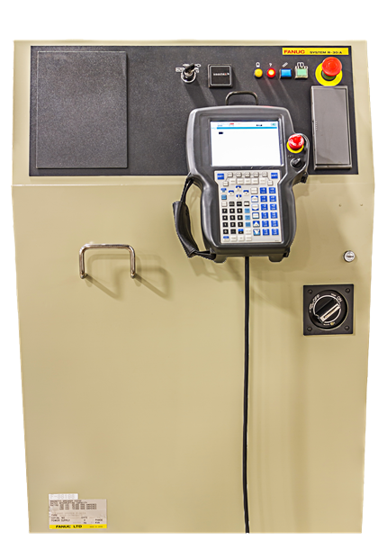
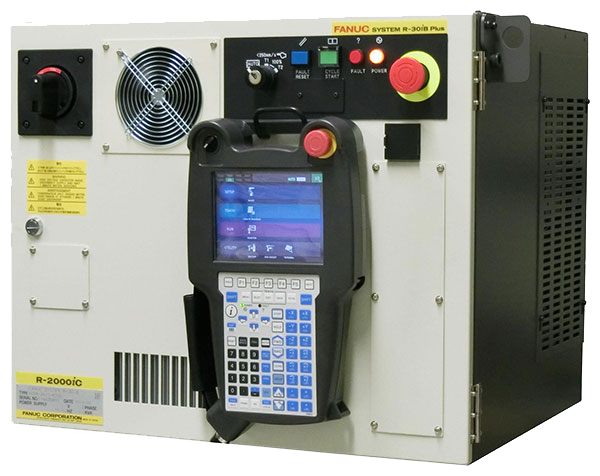
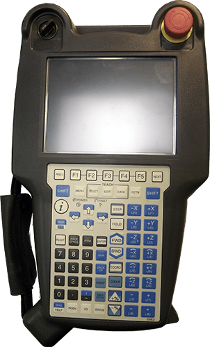

import ConditionalVisibility from '@site/src/components/ConditionalVisibility';

## Hardware Reqs

<ConditionalVisibility paramValue="r30ia" safetyValue="fanuc">
  This is the content for r30ia. It will be visible if the URL contains "?param=r30ia".

:::note
Make sure you have the **R-30iA** controller.
:::

  

</ConditionalVisibility>

<ConditionalVisibility paramValue="r30ib" safetyValue="fanuc">
  This is the content for r30ib (fanuc safety). It will be visible if the URL contains "?param=r30ib&safetyValue=fanuc".

:::note
Make sure you have the **R-30iB** controller.
:::

Here is a table of the reqs.

|Picture|Item|Description|
|---|----------------------|-----------|
||R-30iB Controller|This is the robot's brain.|
||Fanuc pendant|Needed to set parameters during setup and to recover from some errors.|

</ConditionalVisibility>

## Software Reqs

<ConditionalVisibility paramValue="r30ia" safetyValue="fanuc">
  R-30iA Software Reqs
</ConditionalVisibility>

<ConditionalVisibility paramValue="r30ib" safetyValue="fanuc">
  R-30iB Software Reqs (Fanuc Safety)
</ConditionalVisibility>

<ConditionalVisibility paramValue="r30ib" safetyValue="cip">
  R-30iB Software Reqs (CIP Safety)
</ConditionalVisibility>

## Getting Files

## Wiring Table

[Table](../wiring-table)

