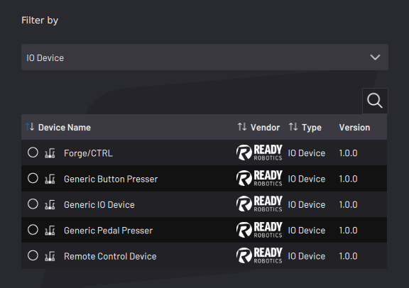

# Adding a Button/Pedal Presser

Follow the instructions in this section to configure a generic button or pedal presser. These steps are for a button presser, but adding a pedal presser follows the same steps.

:::note
The button/pedal presser requires pneumatic or electronic control through I/O. First configure the IPC and I/O devices. See [Fieldbus Configuration](../Settings/FieldbusConfiguration.md) settings to learn more. Then select the signals for controlling air or current to the pressing device.
:::

1.  Select **Generic Button Presser** or **Generic Pedal Presser**. Then tap **NEXT**.

    

2.  Type in a **Device Name**. A **Description** is optional.

    

3.  To make sure your device has enough time to actuate on and off in a task, enter the device's estimated **Actuation Time**. The default value is zero seconds.

:::info
In Task Canvas, that device's control blocks prompt you to choose whether or not the task waits for the set Actuation time.
:::

4.  Tap **ADD NEW OUTPUT SIGNAL**.

    1.  From the **Select Device** dropdown menu, select a configured I/O device driving the presser.

        

    2.  Select the air port\(s\) or I/O signals that your device uses. Tap **SAVE** for each selection.

5.  Once all air port\(s\) required for the device are listed in the **Gripper Control Signals** table, tap **NEXT**.

    

6.  Choose which state \(Release or Press\) corresponds to a **HIGH** or **LOW** signal.

    

:::note
You cannot save the configuration if you select the same conditions for multiple states.
:::

7.  Tap **SAVE** to return to the Device Configuration home screen. Make sure the Button Presser appears on the configured devices list and that it is ​**enabled**​.

:::note
A device is **enabled** when its switch is green and toggled to the right.
:::

