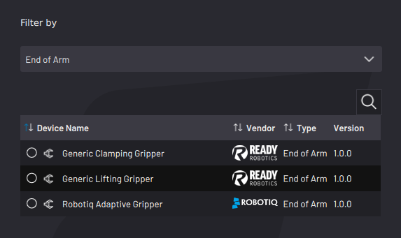
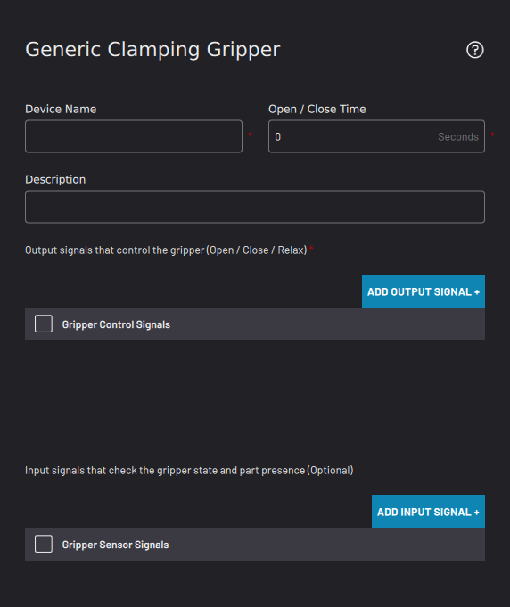
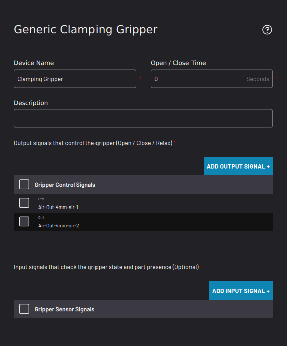
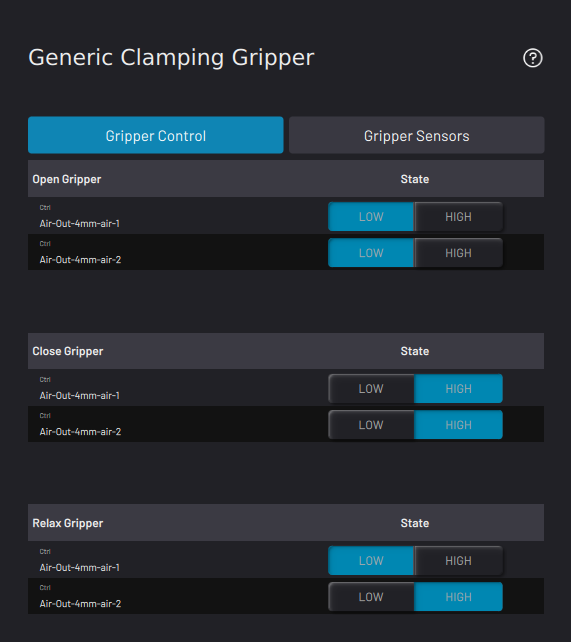

# Adding a Clamping Gripper

Follow these instructions for configuring a pneumatic or electronic clamping gripper. For an advanced clamping device, such as one with digital force control, check if it is supported in the Device Library.

**Note:** To use a clamping gripper without robot I/O, first configure the IPC and I/O devices. See [Fieldbus Configuration](../Settings/FieldbusConfiguration.md) settings to learn more. Then select the signals for controlling air to the gripper.

1.  Select **Generic Clamping Gripper**. Then tap **NEXT**.

    

2.  Enter a**Device Name**. A **Description** is optional.

    

3.  To make sure your device has enough time to actuate on and off in a task, enter the device's estimated **Actuation Time**. The default value is zero seconds.

    **Note:** In Task Canvas, that device's control blocks prompt you to choose whether or not the task waits for the set Actuation time.

4.  Tap **ADD OUTPUT SIGNAL** to select the signals that actuate the gripper.

    1.  From the**Select Device** dropdown menu, select a configured I/O device driving the gripper.

        

    2.  Select the air port\(s\) or I/O signals that your gripper uses. Then tap **SAVE**.

5.  To use gripper sensors to detect the state of the gripper, tap **ADD INPUT SIGNAL**. Repeat the process above to configure the sensor reading signals.

6.  Once all air ports required for the clamping device are listed in the **Gripper Control Signals** table, tap **NEXT**.

    

7.  Choose which gripper state \(Open, Closed, or Relaxed\) corresponds to a **HIGH** or **LOW** signal.

    

    **Note:** You cannot save the gripper configuration if you select the same conditions for multiple gripper states.

8.  Tap **SAVE** to return to the Device Configuration home screen. Make sure the Clamping Gripper appears on the configured devices list and that it is ​**enabled**​.

    **Note:** A device is **enabled** when its switch is green and toggled to the right.

**Parent topic:**[Device Configuration](../DeviceConfiguration/DeviceConfigurationOverview.md)

