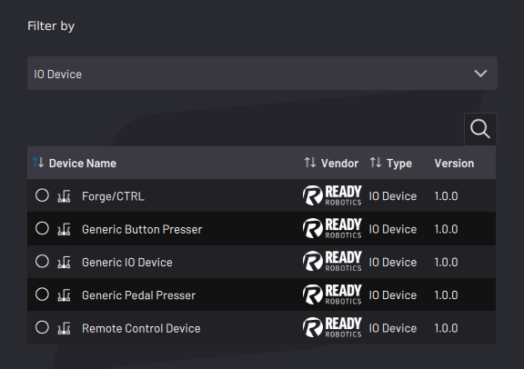
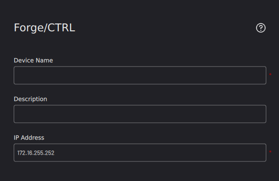
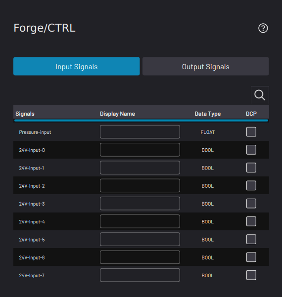

# Adding a Forge/Ctrl

The Forge/Ctrl comes with an internal PLC that gives you access to 24V digital I/O, 4mm pneumatic ports, and 6mm pneumatic ports. To access the digital I/O and pneumatic features, first add the Forge/Ctrl from the Device Library.

1.  In the Device Library, select **Forge/CTRL** \(I/O Device type\). Then tap **NEXT**.

    

2.  Type "Forge/Ctrl" in the **Device Name** field and add a **Description**\(optional\). The **IP address** is **172.16.255.252**. Then tap **NEXT**.

    

3.  Configure any **Input/Output** \(**I/O**\) signals you want to control in the Device Control app.

    1.  Tap the tabs at the top of the screen to toggle between **Input Signals** and **Output Signals.**

    2.  Enter a **Display Name** \(i.e. "Suction Gripper Open", "Finger Gripper Close", or "Button Presser Actuate"\) to signify what each configured signal does.

    3.  If you want a signal to appear in the device's Device Control page, tap the **DCP** checkbox next to that signal.

        

4.  Tap **SAVE** to return to the Device Configuration home screen. Make sure the Forge/Ctrl appears on the configured devices list and that it is **​enabled​**.

    **Note:** A device is **enabled** when its switch is green and toggled to the right.

**Parent topic:**[Device Configuration](../DeviceConfiguration/DeviceConfigurationOverview.md)

