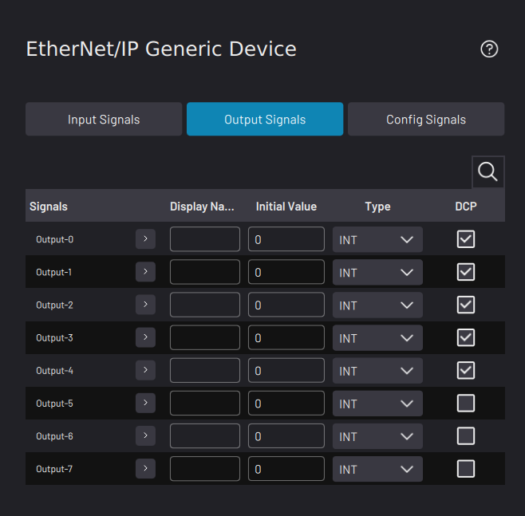

# Adding a Network I/O Device

**Note:** To add a network-based fieldbus device, such as an EtherNet/IP or Modbus TCP device, first add the relevant fieldbus interface in the Settings app. See [Fieldbus Configuration](../Settings/FieldbusConfiguration.md) settings to learn more.

1.  Select the name of your fieldbus device. Then tap **NEXT**.

    

2.  Type in a **Device Name** and any other required information for your I/O device. Refer to the device manufacturer’s guides for device setup parameters.

3.  **\(EtherNet/IP devices only\)** Tap **NEXT** to set up the Input, Output, and Config signals.

    

    **Note:** The **Config Signals** tab is available for the **EtherNet/IP Generic Device**only.

    1.  \(Optional\): Type in a **Display Name** for each signal to show what each signal does.

    2.  For each Output and Config signal, type in an **Initial Value** if you want the signal to be set as soon as Forge/OS connects to the device.

    3.  Choose the data **Type** for each signal in the drop down

    4.  If you want a signal to appear in the device's Device Control page, tap the **DCP** checkbox next to that signal.

4.  Tap **SAVE** to return to the Device Configuration home screen. Make sure the Network I/O device appears on the configured devices list and that it is ​**enabled**​.

    **Note:** A device is **enabled** when its switch is green and toggled to the right.

**Parent topic:**[Device Configuration](../DeviceConfiguration/DeviceConfigurationOverview.md)

