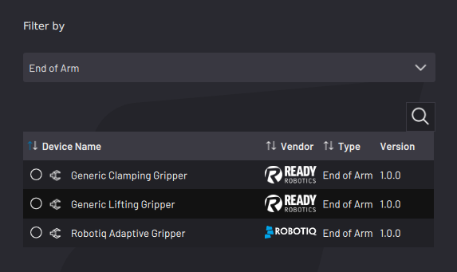

# Adding a Robotiq Adaptive Gripper

Follow these instructions to add a Robotiq adaptive gripper.

:::note
The Robotiq adaptive gripper requires electronic control through a serial fieldbus interface \(Modbus RTU\). The simplest way to control the Robotiq gripper is through an RS-485 to USB adapter. First connect the adapter to a USB port on the IPC and add a Modbus RTU serial interface to Forge/OS. See Robotiq instructions and [Fieldbus Configuration](../Settings/FieldbusConfiguration.md) settings to learn more.
:::

1.  Select **Robotiq Adaptive Gripper**, then tap **NEXT**.

    

2.  Type in a**Device Name**. Then select the serial **RS485 Interface** \(the Modbus RTU interface you added in **Fieldbus Configuration**\). A **Description** is optional.

    

3.  Choose a **Gripper ID**. Enter a unique **Gripper ID** if you are using multiple devices over the same serial interface. Leave the default ID value if you are using one serial device.

4.  Tap **SAVE** to return to the **Device Configuration** main screen. Make sure the Robotiq Adaptive Gripper appears on the Configured Devices list and make sure it's ​**enabled**​.

:::note
A device is **enabled** when its switch is green and toggled to the right.
:::

