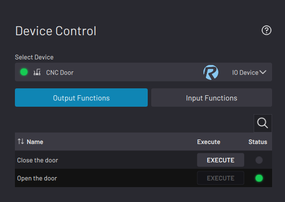
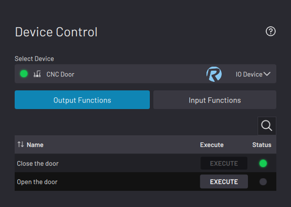
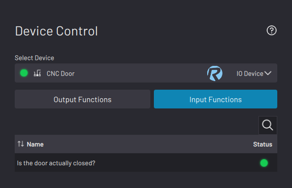

# Controlling a Generic IO Device

When you select a generic IO device, the app shows the status of its output and input functions.

In the **Output Functions** tab, tap **EXECUTE** next to a function that you want to run. When a function's conditions are satisfied, its EXECUTE button is greyed out and its status light is green.

For example, suppose you have a CNC mill. Two actions that you can do with its door are close it or open it. Each of these actions use the same signal, except one is set to LOW while the other is set to HIGH. When you execute the "Open the door" function, the "Close the door" function's status light turns from green to grey.

|||

In the **Input Functions** tab, see the status of read-only input functions. Functions with satisfied conditions have a green status light.

**Parent topic:**[Device Control](../DeviceControls/DeviceControlOverview.md)

