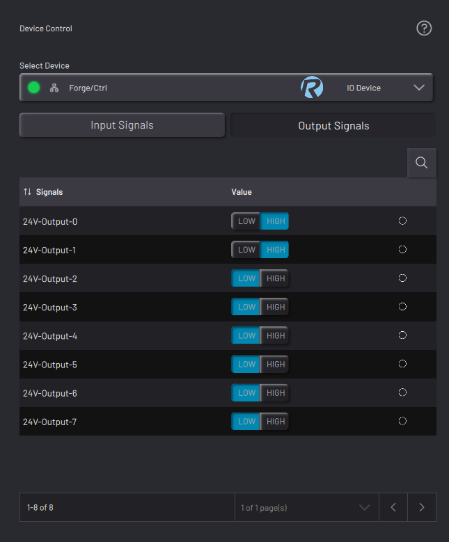

# Controlling a Network I/O Device

When you select an I/O device, the app shows selection tabs for **Input Signals**, **Output Signals**, and **Config Signals**. The Config Signals tab is available for the EtherNet/IP Generic Device only.

|Feature|Description|
|-------|-----------|
|Input Signal List|View a sortable list of Read Only \(Inputs\) signals, including the display and signal names, real-time values, and units. The value of LOW/HIGH signals appears blue.

|
|Output Signal List|View a sortable list of Writeable \(Output\) signals, including the display and signal names, value controls, and an active indicator. Set digital signals using the LOW and HIGH toggle buttons. The active LOW/HIGH toggle button appears blue.

|
|Config Signal List|\(Only available for the **EtherNet/IP Generic Device**.\) View a sortable list of READ ONLY Config signals, including the display and signal names and real-time values.The value of LOW/HIGH signals appears blue.

|

**Parent topic:**[Device Control](../DeviceControls/DeviceControlOverview.md)

