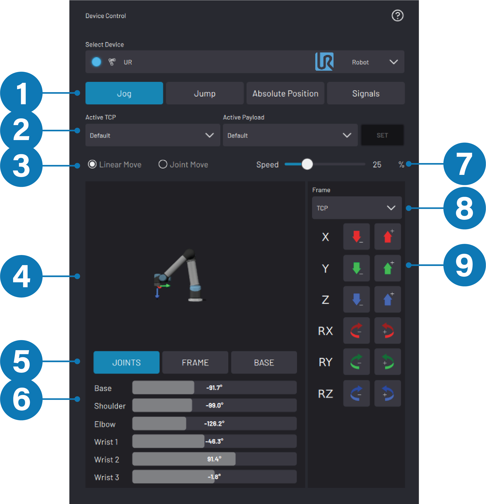
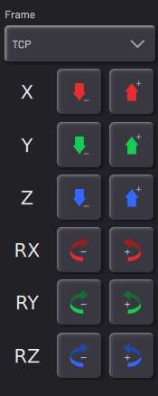
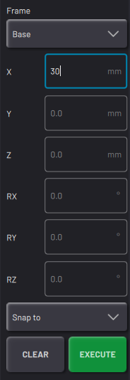
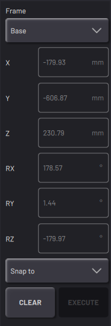
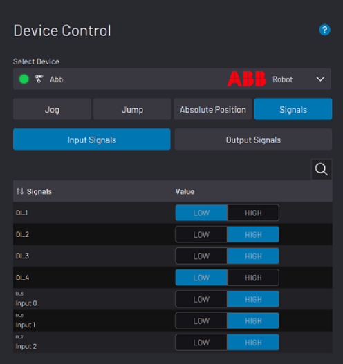

# Controlling a Robot

When you select a robot, the control panel depends on the control mode you select. The available modes are **Jog, Jump, Absolute Position,** and **Signals**.

:::info
The robot must be in **TEACH** mode or **PROGRAM** mode to control it from the Device Control app. See [Device Status Panel](../Platform/DeviceStatusPanel.md) for more on robot states.
:::

When you select one of the three motion modes, the panel shows a 3D visualization of the robot arm, robot position data, and motion controls.

|No.|Robot Control Feature|Description|
|---|---------------------|-----------|
|1|Mode Selection|Enter the **Jog**, **Jump**, **Absolute Position**, or **Signals** mode.|
|2|TCP/Payload Selection|Tap the dropdowns to choose the **Active Tool Center Point \(TCP\)** and/or **Active Payload**. Tap **SET** to update the active TCP and Payloads.|
|3|Linear/Joint Move Selection|Move the robot linearly in a Cartesian frame or in Joint space. The Jog/Jump Controls panel updates for the type of move you choose.|
|4|3D Visualization Window|Interact with a 3D rendering of the selected robot arm. Rotate the view by dragging one finger across the window. Zoom in or out by using two fingers on the window in a pinching motion.**Note:** The selected Frame is displayed over the 3D rendering for reference.|
|5|Position Data Selection|Select a type of robot position data to view. -   **Joints** displays absolute joint position data. **Frame** displays the TCP pose relative to the origin of the selected frame.**Base** displays the TCP pose relative to the Base frame.|
|6|Position Data|View the robot's position for each Position Data mode selection. **Note:** You may notice a mismatch between the linear rotational coordinates that you specify and the linear rotational coordinates that the robot reports. See [Absolute Positioning](ControllingRobot.md) or [Check a Waypoint or Frame](../TaskCanvasBlockGlossary/Canvas-Check.md) for more info.|
|7|Speed Slider|Drag the slider to scale the speed of robot moves that you execute from the Device Control app. This slider does **not** affect the Task Canvas speed slider. Also control speed by pressing the keypad speed buttons on the right side of the READY pendant.|
|8|Frame Selection|Choose the Frame for Jog/Jump motions. The 3D Visualization Window displays the selected Frame. Available Frames are TCP, Base, and global Frames. To learn more about Frames, see [Create and Manage Frames](../TaskCanvas/CreateAndManageFrames.md).|
|9|Jog Controls \(Jog mode\)|Press and hold the Jog buttons to move the robot in the selected Frame at the speed set by the Speed Slider. When you choose **Linear Move**, the Jog buttons correspond to linear and rotational motion \(+/-\) relative to each axis in the selected Frame. When you choose **Joint Move**, the Jog buttons correspond to +/- rotation for each joint on the robot arm.|
|9|Jump Controls \(Jump mode\)|Enter **Jump By** values and tap **EXECUTE JUMP** to move the robot arm relative to the position it is in. When you choose **Linear Move**, specify a linear or rotational distance \(+/-\) relative to each axis in the selected Frame. When you choose **Joint Move**, specify the rotational distance \(+/-\) for each joint on the robot arm.|
|9|Absolute Position Controls \(Absolute Position mode\)|Enter **Jump To** values and tap **EXECUTE JUMP** to move the robot arm to that absolute position relative to the selected Frame, usually Base. When you choose **Linear Move**, specify the Cartesian coordinates of the TCP relative to the selected Frame. When you choose **Joint Move**, specify the absolute positions to which each joint moves.|
|9|"Snap to" Controls|Access in the **Jump** and **Absolute Position** modes. Align the TCP Frame with the selected Frame. Use this feature to align the tool and visualize where the robot will move. You must select a Frame other than TCP. **Snap +Z axis** aligns the TCP's +Z axis to the selected Frame's closest axis. **Snap all axes** aligns all of the TCP's axes with those of the selected Frame by moving the shortest distance possible. Also execute the Snap To command by pressing the keypad Start button on the READY pendant.|

## Jogging

Jogging is when you manually move the robot by holding a directional button. 

:::info
In Jog mode, the READY pendant's keypad Jog buttons also move the robot. If the robot is in Teach Mode, jog the robot with the keypad Jog buttons no matter which app is open. The robot jogs with the most recently selected Frame, speed, and mode \(Linear/Joint\).
:::

:::tip
Jog at a low speed if you're not sure which direction is positive.
:::

There are two modes of jogging: Linear and Joint.

### Linear Jog

Jog the robot's Tool Center Point \(TCP\) in the selected Frame along each of that Frame's coordinate axes \(X, Y, Z\). Rotate the TCP around each of the selected Frame's axes \(RX, RY, RZ\).

### Joint Jog

Rotate the robot's joints in that joint axis's positive or negative direction.

## Jumping

Jumping is when you move the robot by a set distance in at least one direction. Refer to the 3D Visualization Window to see how the robot will move. Perform the jump by pressing **EXECUTE** or by pressing the keypad **Start** button on the READY pendant.

There are two modes of jumping: Linear and Joint.

### Linear Jump

Move the TCP by a set distance relative to its position in the selected Frame. Rotate the TCP by a set number of degrees around the Frame's axes \(RX, RY, RZ\).

### Joint Jump 

Rotate one of more joints by a set number of degrees.

## Absolute Positioning

Absolute positioning is when you move the robot to an exact position using coordinates or joint positions. Refer to the 3D Visualization Window to see how the robot will move. Perform the jump by pressing **EXECUTE** or by pressing the keypad **Start** button on the READY pendant.

There are two modes of absolute positioning: Linear and Joint.

### Linear Absolute Positioning 

The coordinate boxes show the TCP's position in light gray text. Move the TCP to a set position \(X, Y, and Z\) in the selected Frame. Rotate the TCP around the Frame's axes \(RX, RY, RZ\).

:::note
**You may notice a mismatch between the linear rotational coordinates that you specify and the linear rotational coordinates that the robot reports.** For example, if you Absolute Position the robot to the \(Rx, Ry, Rz\) values of \(-150deg, 110deg, -165deg\) in the Base Frame, the reported values in the “Base” position data tab could be \(30deg, 70deg, 15deg\).

Even though robots accept Ry values between -180deg and 180deg, they only report Ry values between -90deg and 90deg. If your robot adjusts a specified Ry value to fit inside the latter range, it adjusts Rx and Rz values as well. **The specified values and adjusted values represent the same position, so the robot will move as expected. However, the different notation may cause Check blocks to fail.**
:::

### Joint Absolute Positioning

The coordinate boxes show each joint's position in light gray text. Move one or more joints to a set position \(in degrees\).

## Signals

When you select the **Signals** mode, the panel shows a list of Read Only \(Input\) signals or a list of Writeable \(Output\) signals.

Toggle between input and output signals by tapping **Input Signals** and **Output Signals**.

For a signal to appear in the Device Control app, select its **DCP** **checkbox** in Device Configuration.

-   The **Input Signals** list shows the robot's configured Input signals in real-time. Analog signals display as float values. Digital signals display as LOW or HIGH.

-   In the **Output Signals** list, set the values of the robot's configured Output signals. Set the value of analog signals by typing a number in the field. Set digital signals using the **LOW** and **HIGH** toggle buttons. The active LOW/HIGH toggle button appears blue.

See [Controlling a Network I/O Device](ControllingNetworkDevice.md) to learn more about Input/Output signal control.

## Active TCP/Payload Selection

To change the **Active TCP** and/or the **Active Payload**, choose the options you want in the dropdowns. Then tap **SET**. The TCP/Payload options are the ones you add in the robot's Device Configuration \(see [Adding a Robot](../DeviceConfiguration/AddingRobot.md)\).

:::tip
Don't forget to tap **SET** to change the Active TCP and Payload to the selected values.
:::

The Active TCP and Active Payload are listed in the Device Status Panel \(via the “DEVICE STATUS” button\) and the side legend \(via the arrow in the bottom-right corner\).

See [Set TCP/Payload Block](../TaskCanvasBlockGlossary/Robot-SetTCPAndPayload.md) to learn more about setting the Active TCP/Payload in a task.

### Active TCP

The Active Tool Center Point is where the end effector interacts with objects. It's the point around which the end effector moves and rotates when the robot executes linear moves. 

When you select the TCP Frame in the Linear Move mode, the Active TCP appears in the 3D Visualization for reference.

:::danger
ForgeOS uses the Active TCP to define Waypoints and Frames. Setting the correct TCP on the robot is crucial for precise motion control in the Device Control app and in Task Canvas.
:::

### Active Payload

The Active Payload tells the robot to account for the amount of weight at the end of its arm. Update the Active Payload whenever the actual payload changes, such as after picking up or putting down a part or tool.

:::danger
A mismatch between the expected payload \(Active Payload\) and actual payload can cause unexpected motion and safety-related robot errors.
:::

## Frame Selection

All linear moves occur at the end effector \(Active TCP\) relative to the selected **Frame**. Choose the Frame to control the direction of motion from the Frame dropdown. When you choose Linear Move, the 3D Visualization window shows the selected Frame for reference.

Every robot has a TCP and Base frame by default.

-   The **TCP** Frame is defined by the Active TCP's orientation. Its position and orientation move whenever the robot and attached tooling move. Select the TCP Frame to move and rotate the end effector relative to the TCP.

-   The **Base** Frame is at the base of the robot. It does not change orientation when the robot moves. Select the Base Frame to move and rotate the end effector relative to the Base coordinates of the robot.

For information on how to view a custom Frame in the Device Control app, see [Create and Manage Frames](../TaskCanvas/CreateAndManageFrames.md)

