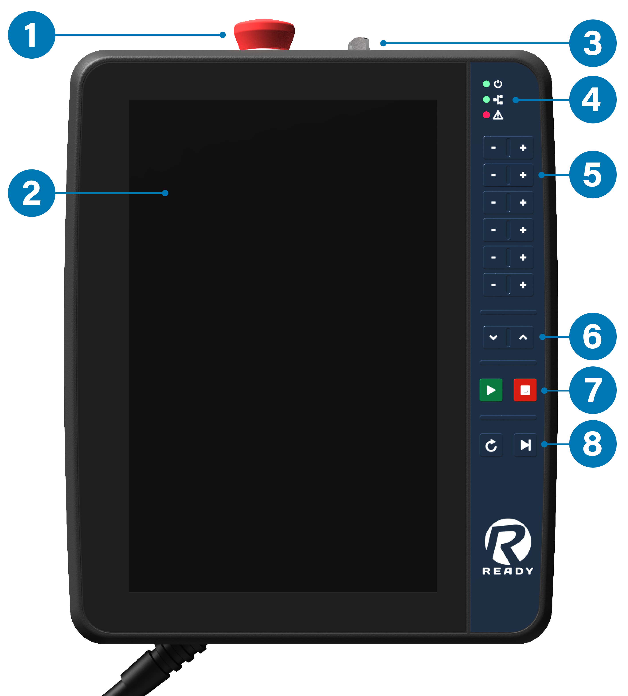
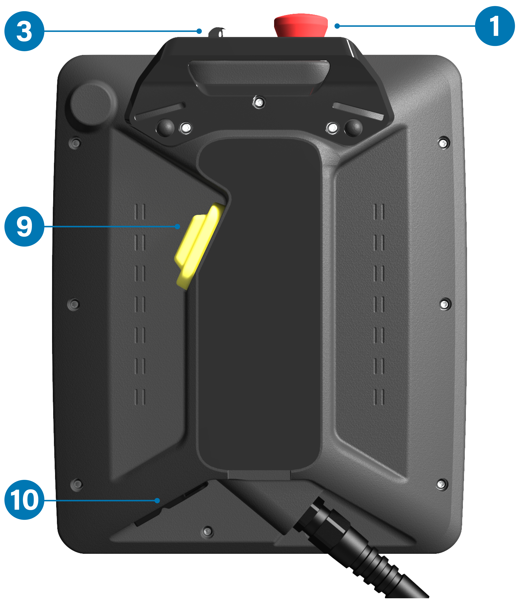
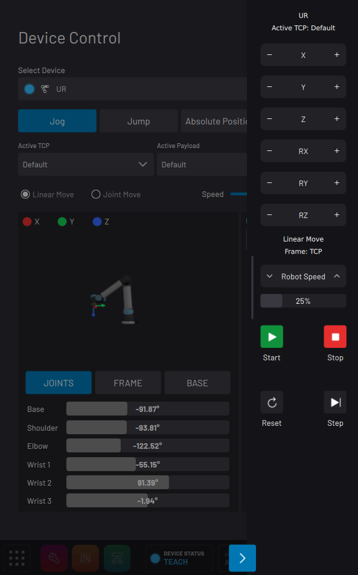
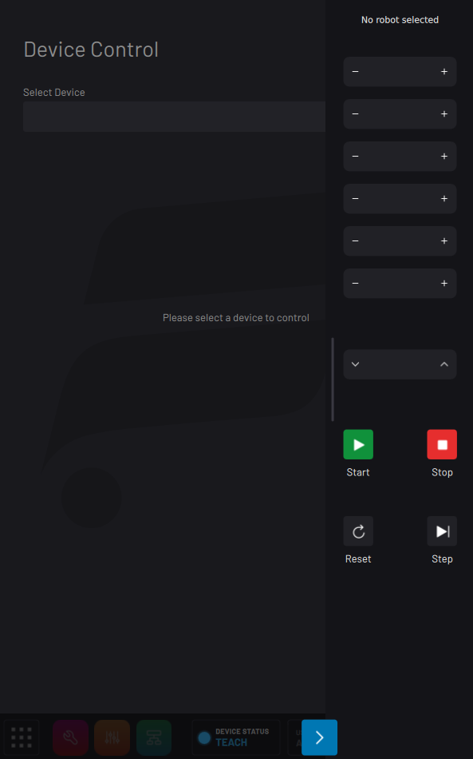

# READY Pendant Overview

The READY pendant is the touch screen interface for ForgeOS. ForgeOS software runs on both the READY pendant and an **industrial PC \(IPC\)**. Together, they are the brain of your workcell.

## Safety Notices

The READY pendant has dual-channel safety features for use with robots and other devices. Safety features include an enabling device, an emergency stop button, and a keyed mode selector switch. All safety functions comply with EN ISO 13849-1 PLe, Category 4.

Follow this manual to avoid malfunctions or damage to the pendant.

:::caution

**Handle the READY pendant with care.**

- Do not use the READY pendant if defective or damaged.
- Do not use outdoors.
- Do not expose to excessive dust, humidity, or electromagnetic fields.
- Do not crush or damage the cable with any object.
- Do not lay the cable over sharp edges.
- Never clean the housing, touch screen, or operating elements with solvents, scouring agents, or scrubbing sponges. Use only a soft cloth and mild detergent.
- Avoid contact with liquids.
- Make sure that no foreign objects or liquids can penetrate the device.
- Check the cables and protective covers regularly for damage.
- Do not leave near heat sources or in direct sunlight.
- Avoid dropping and don't place on unstable surfaces.
- Do not open the housing. The READY pendant is sensitive to electrostatic discharge.
- To avoid damage to the touch screen, do not place the READY pendant on a surface with the screen facing down.
- Never use sharp objects to operate the touch screen and keypad \(e.g., screwdriver, ballpoint pen, etc.\). Use only your fingers or a touch-pen.
- Make sure your hands or gloves are clean and free of oils or abrasive debris.

:::

## Specifications

|**Category**|**READY Pendant Specification**|
|------------------|------|
|Dimensions|215\(W\) x 284\(H\) x 69\(D\) mm \(without mounting bracket\)|
|Weight|Approx. 1120 g|
|Display|10.1" TFT, Projected capacitive touch screen, multi-touch 800 x 1280 pixel \(16:10\) WXGA|
|Safety Elements|Emergency-stop button, 2 channels, IEC 60947-5-5 Compliant Enabling switch, 3 position, 2 channels, IEC 60947-5-8 Compliant Mode selector key switch, 2 positions \(two keys included\) \(Replacement keys: IDEC AS6-SK\)|
|Other Components|Membrane keypad, 18 buttons, 3 status LEDs|
|Data Transfer|Ethernet 10/100 Mbit/s communication \(internal RJ45 plug\) USB 2.0 transfer \(port\)|
|Cable|10 m, including 200 mm flying leads: RJ45 plug \(4 wires\) for Pendant communication 15 signal wires with ferrule ends|
|Power Supply|24V DC, up to 15 W consumption|
|Environmental Requirements|Operating temp: 0 °C to 45 °C Relative air humidity \(non-condensing\): 5 % to 95 % Vibration resistance according to IEC 60069-2-6 Shock resistance according to EN 61131-2|
|Mechanical Properties|Housing made of PPE/PE Dropworthiness: 1 m \(on industrial floor\), then at least IP54|
|Protection Rating|IP54|

## Cable

The READY pendant cable includes an RJ45 Ethernet connector and 15 flying leads. The Ethernet connector is for communication with the IPC. The flying leads with end ferrules are for the pendant power and safety features. See the table below for a description of the leads.

|**Pendant Cable Lead**|**Signal**|
|------------------|------|
|Brown|Three-Position Enabling Switch Circuit 1|
|Yellow|Three-Position Enabling Switch Circuit 1|
|Green|Three-Position Enabling Switch Circuit 2|
|Grey|Three-Position Enabling Switch Circuit 2|
|Pink|24V DC|
|Green/Brown|Emergency Stop Circuit 1|
|White/Green|Emergency Stop Circuit 1|
|Grey/Pink|Emergency Stop Circuit 2|
|Red/Blue|Emergency Stop Circuit 2|
|Black|0V DC|
|Violet|Key Switch Circuit 1|
|White/Pink|Key Switch Circuit 1|
|White|Key Switch Circuit 2|
|Blue|Key Switch Circuit 2|
|White/Blue|Not Connected|
|**Shielded Communication Wires:**|
|Blue, Pin 1|TD+ \(Ethernet to IPC\)|
|Orange, Pin 2|TD- \(Ethernet to IPC\)|
|White, Pin 3|RD+ \(Ethernet from IPC\)|
|Red, Pin 6|RD- \(Ethernet from IPC\)|

## Functionality

See the images and table below for READY pendant features.

:::info
The hand strap for holding the pendant is not shown. Set up the strap for either left-handed or right-handed use.
:::

|No.|Feature|Description|
|---|-------|-----------|
|1|Emergency Stop Button|Trigger an emergency stop state with this red-yellow button \(DPST\).Press down to open the safety circuits. This stops the robot and other devices. Twist clockwise to release the button and close the circuits.|
|2|Touch Screen|Interact with ForgeOS on this multi-touch display.|
|3|Mode Selector Key Switch|Insert the key and turn to select between **Run Mode** \(clockwise\) and **Teach Mode** \(counter-clockwise\).|
|4|Status LEDs|**Green Power LED** - Solid green means the pendant is on. **Green Network LED** - Solid green means a good connection to the IPC. **Red Error LED** - Solid red means there is a device error. Off indicates normal system status.|
|5|Jog Buttons|Jog the most recently selected robot in the selected Frame. If you select **Linear** in the Device Control app, these jog buttons move the robot's TCP in X, Y, Z, RX, RY, and RZ. If you select **Joint**, the buttons move the robot joints. Holding two buttons in the same row at one time results in no motion.|
|6|Speed Control Buttons|**Decrease Speed** and **Increase Speed**. While a task is running, control the runtime speed slider. While a task is not running, control the speed in the Device Control app.|
|7|Start/Stop Buttons|**Start**: Use in the Task Canvas app to start the task \(Run mode\). Use in the Device Control app to execute a jump/absolute position command. **Stop**: Stop Task Canvas execution and all robot motions.|
|8|Reset/Step Buttons|**Reset**: Send a reset signal to all devices to fix errors. **Step**: Execute the selected block in Task Canvas.|
|9|Three-Position Enabling Switch|Enable robot motion control with this three-position switch \(DPDT\). Most robots require this enabling device when the READY pendant is in Teach Mode. To use, press the switch into the middle position \(ON\). If you release or squeeze the switch too tightly in Teach Mode, the robot will not move \(OFF\).|
|10|USB Port|Connect USB devices to the pendant. Connect a USB keyboard to type in fields on the screen.|

:::tip
If you forget what the keypad buttons do, tap the arrow in the bottom-right corner \(or swipe left from the right edge of the screen\) to see labels! If you have a robot selected to jog in the Device Control app and it's in Teach/Program mode, this legend lists the currently-selected Active TCP, move type, frame, and speed. If you do not have a robot selected or if it's unable to jog, the -/+ section of this legend appears blank.
|
:::

