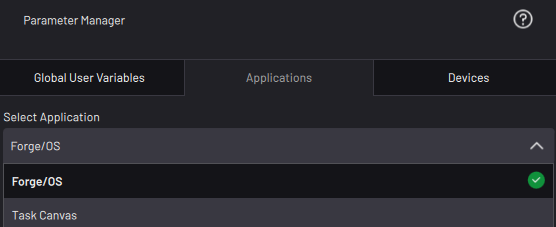

# Applications

The Applications tab displays float, integer, date/time, boolean, and string data relevant to the selected app.

|In the **Select Application** dropdown, select whether you want to view **ForgeOS** or **Task Canvas** data.

||

|App|Parameter|Type|Description|
|---|---------|----|-----------|
|Forge/OS|Date-Time|Date/Time|The system date and time, updated every second. Displays as \[month/day/year\] and \[hours/minutes/seconds\].|
|Weekday|String|The current weekday \(not abbreviated\).|
|Admin Logged In|Boolean|-   **True** when logged in as an Admin.
-   **False** when logged in as another account or on the Sign In screen.

|
|Operator Logged In|Boolean|-   **True** when you are logged in as an Operator.
-   ****False****when you are logged in as another account or on the Sign In screen.

|
|Hard Drive Free Space|Float|The amount of free space on the ForgeOS hard drive, in megabytes \(MB\).|
|Task Canvas|Task Executing|Boolean|-   **True** when a task is executing, either from the Start Task or Start From Selected options in the Runtime Menu.
-   **False** when a task is stopped or a block is being Stepped.

|
|Current Task Name|String|The name of the task that is currently open in Task Canvas. Blank when no task is open.|
|Last Task Passed|Boolean|-   **True** when the last executed task finished on a "Finish" block set to "Passed".
-   **False** when a task begins executing.

 **Note:** This entry is not True when a task ends by running out of blocks or when you stop the task.

|
|Last Task Failed|Boolean|-   **True** when the last executed task finished on a "Finish" block set to "Failed".
-   **False** when a task begins executing.

 **Note:** This entry is not True when a task ends by running out of blocks or when you stop the task.

|

**Parent topic:**[Parameter Manager](../ParameterManager/ParameterManagerOverview.md)

