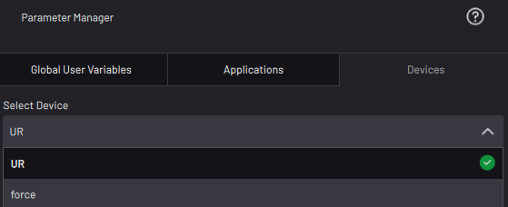

# Devices

The Devices tab displays frame, float, double, integer, boolean, and string data relevant to the selected device.

In the **Select Device** dropdown, select which device's data you want to view. All devices added in the Device Configuration app show in the dropdown.

|Device|Parameter\(s\)|Type|Description|
|------|--------------|----|-----------|
|\(All Devices\)|Device Status|String|The current device status as reported to the Device Status Panel. A device reports **Fault** when it's in an error state or it's disabled in Device Configuration.|
|6 Axis Robot|Global Speed Setting|Double|A percentage of max speed, as last confirmed by the robot. This parameter automatically updates when you adjust the speed in the Device Control app in Teach Mode. This parameter does not automatically update when you adjust the speed in the Task Canvas app in Run Mode until you execute a move at the new speed. For example, if you execute a move in Run Mode at 100% speed and then reduce the Task Canvas speed, the Global Speed Setting parameter still reports “100%” until you execute another move. Because of this, you cannot adjust the speed and then start a task that immediately checks the Global Speed Parameter.|
|6 Axis Robot|Active TCP|String|The name of the active TCP.|
|6 Axis Robot|Active Payload|String|The name of the active payload.|
|6 Axis Robot|Robot Motion Possible|Boolean|Defined by the motor state, device status, and safety inputs \(e.g., enabling switch\).  **True** if robot motion is possible. **False** if robot motion is not possible.|
|6 Axis Robot|Robot in Motion|Boolean| **True** if the robot is moving. **False** if the robot is not moving.|
|6 Axis Robot|TCP X, Y, Z Velocities|Double|The current velocity of the TCP in the X, Y, and Z directions of the TCP coordinate frame.|
|6 Axis Robot|TCP RX, RY, RZ Velocities|Double|The current rotational velocity of the TCP in the RX, RY, and RZ directions of the TCP coordinate frame.|
|6 Axis Robot|TCP X, Y, Z Velocities in Base Frame|Double|The current velocity of the TCP in the X, Y, and Z directions of the Base frame.|
|6 Axis Robot|TCP RX, RY, RZ Velocities in Base Frame|Double|The current rotational velocity of the TCP in the RX, RY, and RZ directions of the Base frame.|
|6 Axis Robot|TCP Speed|Double|The current speed of the TCP, independent of direction.|
|6 Axis Robot|J1-J6 Velocities|Double|The current rotational velocity of joints 1-6.|
|6 Axis Robot|Frame\(s\)|1-Point Frame or 3-Point Frame|The frame that the selected frame references.|
|Generic Clamping/Lifting Gripper|Gripper State|String|The current state of the gripper as defined by its control signals. Possible values are **grasped**, **released**, and **relaxed**.|
|Generic Clamping/Lifting Gripper|Sensor State|String|The current state of the gripper sensor. Possible values are **open**, **closed**, and **part present**. Blank if sensor signals are not configured.|
|Smart Clamping Gripper|Gripper Position|Double|The current position of the gripper fingers.  **0**: Fully open.  **100**: Fully closed.|
|Generic Button/Pedal Presser|Presser State|String|The current state of the device as defined by its control signals. Possible values are **pressed** and **released**.|

