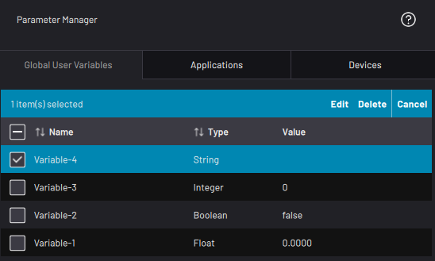

# Global User Variables

The Global User Variables tab displays data for each global variable. If a variable is **global**, you can access it in the Parameter Manager and in all Task Canvas tasks.

:::info
Variables that you create in the Parameter Manager are *always* global. Variables that you create in a task \([Variable Manager](../TaskCanvas/CreateAndManageVariables.md)\) are local to the task, but they can be made global.
:::

Possible variable types are:
-   Float
-   Boolean
-   Integer
-   String

To edit a global variable in the Parameter Manager, select it and tap **Edit** at the top of the table.

To delete a global variable, select it and tap **Delete** at the top of the table.

