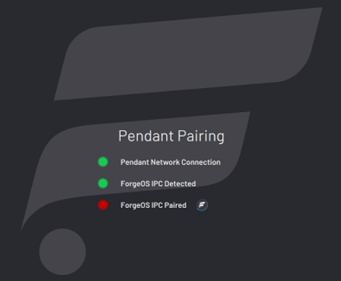

# Device Status Panel

The **Device Status Panel**displays the operational mode or state of all enabled devices. Expand the panel by tapping the **DEVICE STATUS**button in the Taskbar.

The possible robot states are:

|Robot State|Description|
|-----------|-----------|
||The *collaborative*robot can be moved by hand.

|
||The robot is in a manual reduced speed mode, the READY pendant enabling switch is not pressed, and the motors are off.|
||The robot is in a manual reduced speed mode, the READY pendant enabling switch is pressed in the middle position, and the motors are on.|
||The robot is in a manual reduced speed mode where speeds are limited by ForgeOS instead of the robot safety system. The READY pendant enabling switch is not required.|
||The robot is in an automatic full speed mode. It's ready to run a task.|
||The robot requires a reset from ForgeOS.|
||The robot requires a reset from ForgeOS or other actions to regain normal operation.|

|For robots requiring the **Mode Selector Key Switch**, turn the key to select between **Run** \(clockwise\) and **Teach** \(counter-clockwise\).

||

|For collaborative robots, open the Device Status Panel and tap to choose a robot mode.

**Tip:** You cannot toggle directly from Hand Guide mode to Run mode. First switch to Teach mode to make Run mode available.

||

|For robots with **PROGRAM** mode, open the Device Status Panel and tap to choose a robot mode. For example, tap **PROGRAM**to change the robot to Program mode.

||

**Note:** Robots that do not require hardware switching between modes will always start up in Run mode after a ForgeOS restart. This allows for a smooth integration with Remote Control mode.

The possible states for other devices are:

|Device State|Description|
|------------|-----------|
||The device is connected and in a normal state.|
||The device requires a reset from ForgeOS.|
||The device requires a reset from ForgeOS or other actions to regain normal operation.|

|Expand the panel and tap **MORE** to read possible causes and fixes.

The **RESET**button clears warnings and errors when possible. All safety conditions, such as the pendant enabling switch and key switch, must be met.

||

**Note:** For hardware errors that will not reset in ForgeOS, follow the manufacturer's error recovery procedures.

**Parent topic:**[ForgeOS Platform](../Platform/PlatformOverview.md)

