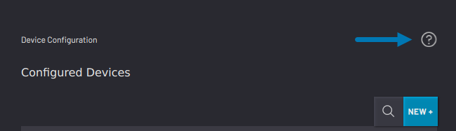
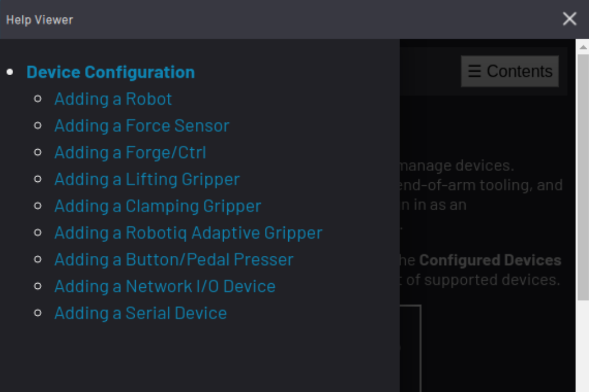
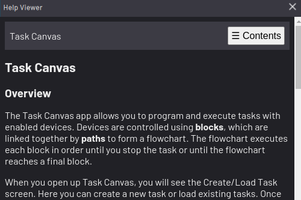

# Help Viewer

The Help Viewer displays additional information and instructions for using features in ForgeOS.

To open the Help Viewer, tap the **?** icon in the upper-right corner of the screen or pop-up, when available. In the Task Canvas app, select **Help** in the **File** menu.

In some cases, there are links to relevant topics within the help text. To see more contents or subtopics, tap **Contents**.

