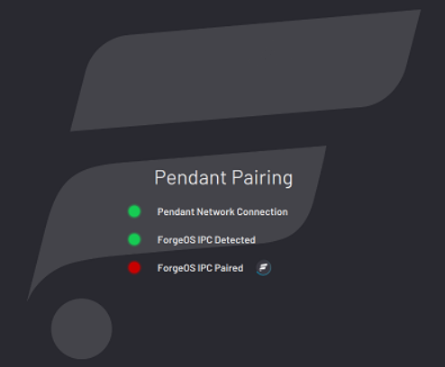
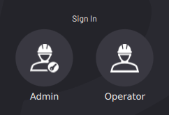

# Installing ForgeOS

Follow these steps to install ForgeOS and sign in to the Admin role. You need a ForgeOS installation USB flash drive. Installation takes about 30 minutes, depending on the resources of the IPC. 

:::caution
Installing ForgeOS will erase all data on the target hard drive.
:::

Connect a monitor, keyboard, and mouse to the IPC where you want to install ForgeOS.

Plug the ForgeOS installation USB flash drive into the IPC.

:::tip
If you need more USB ports, use a USB 3.0 hub.
:::

        
Restart the IPC. While the IPC is powering on, press the keyboard hotkey that takes you to the Boot Menu.

:::tip
The key that opens the Boot Menu depends on the IPC model. The most common keys that do this are ESC, F10, F11, or F12. Refer to your computer's documentation for boot options.
:::

:::info
If you're installing Forge/OS on a **Forge/Ctrl**, press F11. You may need to enter the **BIOS Admin password**. Contact READY Support if you run into this issue.
:::
      

From the boot options, select **Install ForgeOS** to boot from the installation USB flash drive.

The installer may take several minutes to load. Wait until the installation wizard opens.

Select your language. Then click **Install Forge**.

Choose a keyboard layout. Then click **Continue**.

Select **Minimal installation**. Uncheck **Download updates while installing forgeos**. Then click **Continue**.

Select **Erase disk and install forgeos**. Then click **Continue**.

:::info
If ForgeOS is already installed, the installation wizard will show additional options. The goal is to erase the entire disk for a brand new installation.
:::

Select the IPC hard drive for ForgeOS and click **Install Now**.

Confirm that you want to erase the entire disk by clicking **Continue**.

Make a note of the pendant instructions. If you're using a Forge/Ctrl, select the checkbox next to **This hardware is a Forge CTRL**.

Choose your timezone. Then click **Continue**.

Choose your IPC's host name. The host name identifies the IPC on the network. Pick a username and password. Then click **Continue.**

:::info
The username and password that you create here are for accessing the IPC desktop. They are NOT for signing into ForgeOS on the READY pendant.
:::

Wait for the installer to copy and install ForgeOS.

Once the installation completes, click **Restart Now**.

When prompted, remove the installation flash drive. Then reboot.

Wait for ForgeOS to finish booting.

When you see the login screen with the ForgeOS 5 logo, ForgeOS is ready to run on the READY pendant! You don't need to sign in to the desktop. Disconnect the monitor, keyboard, and mouse that you used to install ForgeOS.

The READY pendant automatically finds and pairs with the IPC. The three LEDs on the screen help you track the status:

- **Pendant Network Connection**: This condition is satisfied when the READY pendant has a valid network connection \(i.e., the Ethernet cable is plugged in\).

- **ForgeOS IPC Detected**: This condition is satisfied when the READY pendant detects a Forge/OS IPC on the network.

- **ForgeOS IPC Paired**: This condition is satisfied when the READY pendant successfully pairs with the IPC. If pairing fails, it is automatically retried indefinitely.

When a condition is not satisfied, the LED is red. When a condition is in progress of becoming satisfied, a spinner around a READY logo appears to the right of the text. When a condition becomes satisfied, the LED turns green.

The UI shows the real-time state of each step. For example, if the pendant loses its network connection during pairing, all steps become undone. If the READY pendant spends more than 60 seconds on any step, troubleshooting text displays. Common things to check are if the READY pendant network cable is plugged in, if the IPC is powered on, if the READY pendant and IPC are connected to the same network, and if there’s only one READY pendant and one IPC on that network.

:::info
The READY pendant IP Address is preset to 172.16.255.253. The network interface that the pendant connects to should use IP Address 172.16.255.250 and Subnet mask 255.255.255.0.
:::

Tap **Admin** and sign in. The default Admin password is "forgeadmin".

:::info
After installation, you have limited access to ForgeOS until you activate it with a license code. See [Activating ForgeOS with a License Code](../Settings/LicenseInfo-Activation.md).
:::

