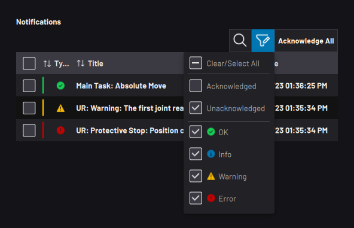
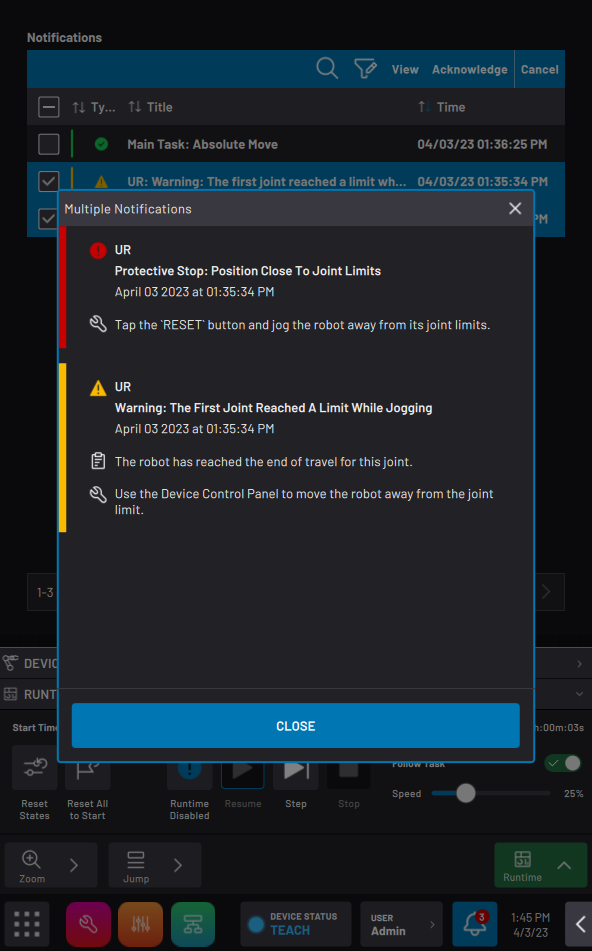

# Notifications Panel

|The Notification Panel displays a table of status history.

 Tap the funnel icon to filter the table. Choose one or more filters to only show certain notification types \(i.e., OK, info, warning, and error\) in the acknowledged list and/or in the unacknowledged list.

||

|New notifications appear in the unacknowledged list until you acknowledge them.

 Select one or more notifications and tap **View** for more information \(such as fix instructions\).

 To clear the selected notification\(s\) to the acknowledged list, tap **Acknowledge**.

 To clear all unacknowledged notifications at once, select no notifications and tap **Acknowledge All**.

||

**Parent topic:**[ForgeOS Platform](../Platform/PlatformOverview.md)

