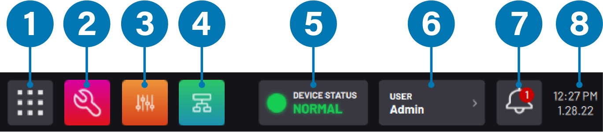

# Taskbar

The **Taskbar** displays app icons, device statuses, and system information. The Taskbar is always available except during task execution.

|No.|Taskbar Item|Description|
|---|------------|-----------|
|1|Home Button|Return to the Home screen. The Home Button switches active apps but does not close them. Apps only close when you log out.|
|2-4|App Icons|Jump between the standard control apps: Device Configuration, Device Control, and Task Canvas. When you are in Remote Control mode, these app icons are replaced with the **Remote Control Status** icon. Change what apps appear here by going to Settings \> [Applications](../Settings/Applications.md).|
|5|Device Status Panel|View the operational mode or state of all devices that are **configured** and**enabled**.|
|6|User Button|View the current user profile name. When you tap the button to expand, you can log out, enter Remote Control mode, or exit Remote Control mode.|
|7|Notifications|View notifications as they occur in the bottom-right corner. After three seconds, they disappear from the bottom-right corner, but they are still stored in the Notifications Panel. Access the Notifications Panel by tapping the bell icon. Any ongoing status information appears in the Device Status Panel. Also access the Notifications Panel by swiping down from the top of the screen.|
|8|Time and Date|The system time and date appear on the Taskbar. To update the time settings, see [General Settings](../Settings/GeneralSettings.md).|

