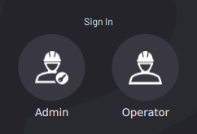

# User Profiles

After you start up ForgeOS, sign in to a user profile. ForgeOS has two user profiles: Admin and Operator.

-   The **Admin** profile is password-protected and has full access to apps in ForgeOS.
-   The **Operator** profile does not have a password and has limited access.

:::tip
The default Admin password is "**forgeadmin**". Change the Admin login password in [User Accounts](../Settings/UserAccounts.md).
:::

The Operator profile **CANNOT:**
- Access the System Settings app. 
- Access the Device Configuration app.
- Create, modify, or remove tasks in Task Canvas.

The Operator profile **CAN:**
- View Device Status and clear device errors. 
- View system notifications. 
- Control an enabled device from the Device Control app. 
- Load a task in Task Canvas. Execute a task in Task Canvas. 
- Interact with user prompts in a running task.
