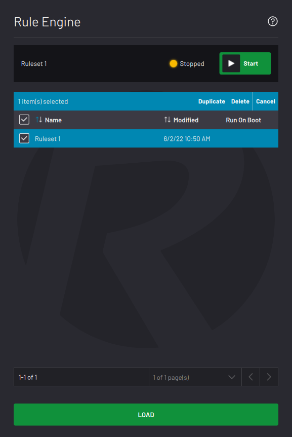

# Load Ruleset

Load a ruleset from the Rule Engine main screen or from the File Menu. The Load Ruleset screen displays the list of saved rulesets.

Select a ruleset in the table and tap **LOAD** to open it.

Tap **Duplicate** in the table header to create a copy of the selected ruleset\(s\).

Tap **Delete** in the table header to remove the selected ruleset\(s\).

