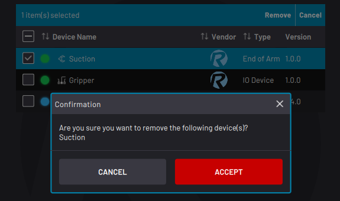

# New Ruleset

To create a ruleset, select **NEW +** from the Rule Engine main screen or **New Ruleset** from the File Menu.

Give the ruleset a unique name.

The ruleset will access all devices that are listed in the table. By default, the device table includes all devices that are enabled in Device Configuration.

Create a ruleset with no devices or with many.

Remove devices by selecting each unwanted device and tapping **Remove**.

:::note
Tapping Remove here hides the selected device\(s\) from this ruleset's list of devices. It does NOT remove the device\(s\) from the Device Configuration app.
:::

To add a device to the ruleset, tap **ADD +**. Select the checkbox next to each device that you want to add and tap **ADD**.

:::note
You can add or remove more devices later from [Ruleset Settings](RulesetSettings.md).
:::

At the bottom, tap **Add Tag** to make the ruleset easier to find later. When searching for the ruleset, enter a tag to filter the search results.

Tap **CREATE RULESET**. ForgeOS directs you that ruleset's manager.

