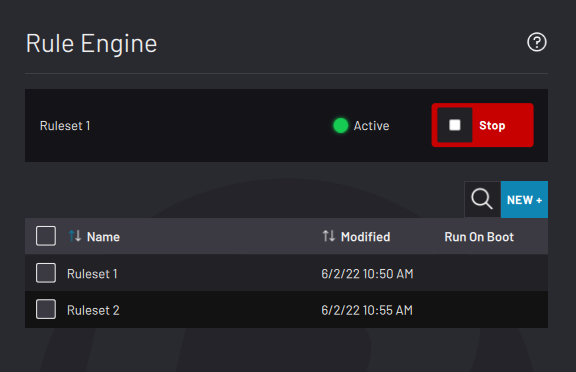
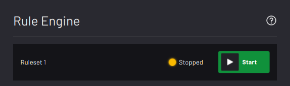

# Rule Engine

The Rule Engine is where you link device signals, system variables, and "if…then" statements. Run these processes in the background of Forge/OS, even when a Task Canvas task isn't executing! This app is great for instructing stack lights to be one color when a task is running and another when the task is idle \(and for many other uses\).

|When you first open the Rule Engine, the Load Ruleset screen appears. Once you create and save rulesets, they show up in the table.

|

|

|At the top of the screen, view the **Active** or **Stopped** status of the ruleset that most recently ran. **Stop** an Active ruleset and **Start** a Stopped ruleset here or in that ruleset's manager.

|

|

-   **[Ruleset Management](../RuleEngine/RulesetManagement.md)**  

-   **[Rule Management](../RuleEngine/RuleManagement.md)**  

