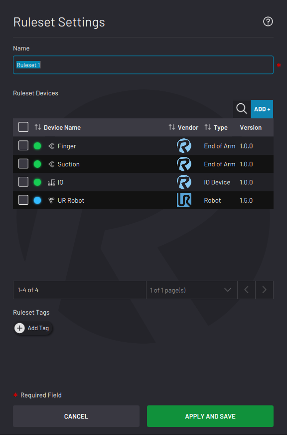

# Ruleset Settings

From the File Menu, tap**Ruleset Settings** to change the settings of your open ruleset.

|In the Name field, type in a name to rename the ruleset.

To add a device to the ruleset, tap **ADD +**. Select the checkbox next to each device that you want to add and tap **ADD**.

In the Ruleset Devices table, select the checkboxes of devices that you want to remove. In the table header, tap **Remove**.

**Note:** Removing a device here does NOT remove it from other rulesets or from the Device Configuration app.

Tap **APPLY AND SAVE** to save the changes and return to the ruleset's manager.

|

|

**Parent topic:**[Ruleset Management](../RuleEngine/RulesetManagement.md)

