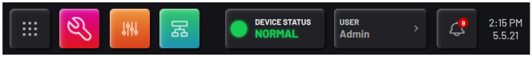
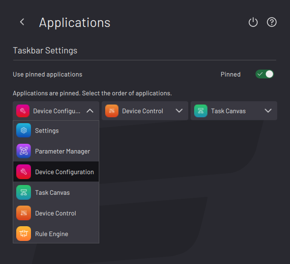
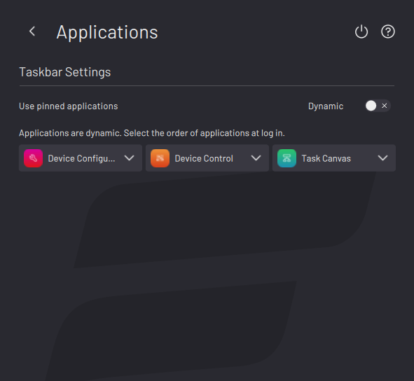

# Applications

The Applications screen is where you choose what app icons appear in the three spots that are to the right of the Home button.

If you enable the “**Pinned**” toggle, your app selections appear in the Taskbar \(in the order that you chose\) as soon as you tap **SAVE**. The order of these three apps will not change as you navigate between them and other apps.

If you disable the toggle, the label switches to “**Dynamic**”. Your app selections appear in the Taskbar \(in the order that you chose\) as soon as you log in again to the Admin profile. The order of the apps dynamically updates to show the three most recently used apps:

-   The active app is on the right.

-   The previously-used app is in the middle.

-   The app that was used before the previously-used app is on the left.

