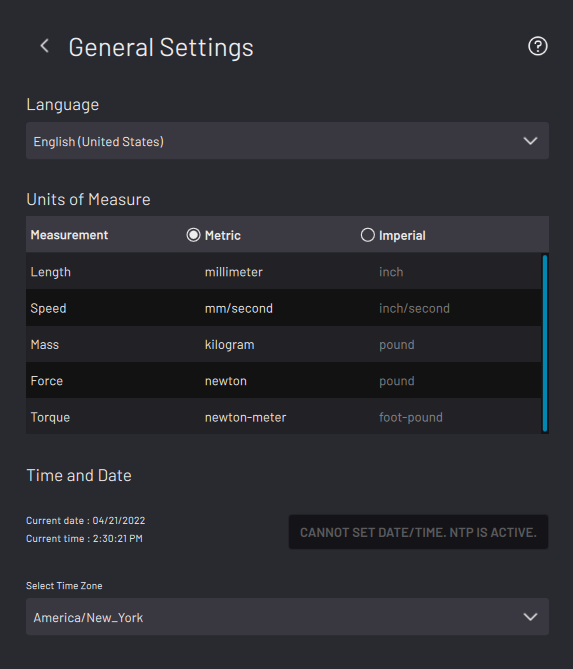
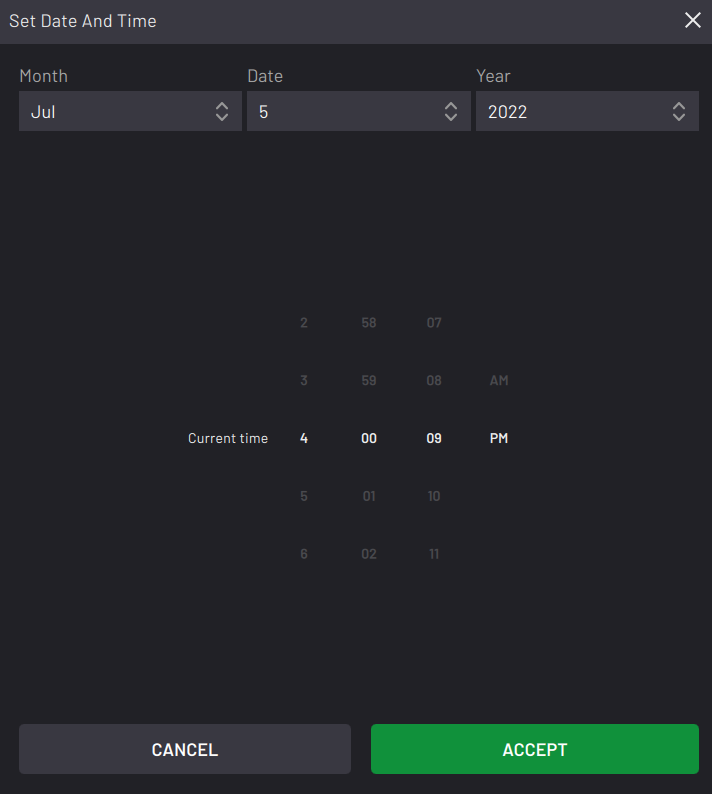
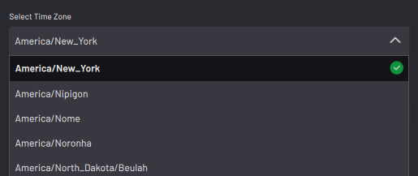

# General Settings

The General Settings screen is where you access language, unit, and time settings.

Select a **Language**. If you change the language, restart the system to display all translatable text into the selected language.

Select **Metric** or **Imperial** units of measurement. The default system of measurement is Metric, but you may change units to Imperial at any time. Changing the unit system will automatically convert numerical values of known units.

:::caution
Variables are not affected by changing units of measure in General Settings. You must manually update variables that are meant for length, speed, or force parameters. Example:

-   If you enter 25mm in the Z field of a move block, then you switch to Imperial units, ForgeOS converts that value to 0.984in.
-   If you create an integer variable with a value of 25 to use in the Z field of a linear relative move, then you switch to Imperial units, Forge/OS does NOT convert that value.
:::

Tap **SET DATE AND TIME** to change the date and time that appears in the Taskbar.

At the top, use the dropdowns to select the current month, day, and year.

At the bottom, use the number scrolls to select the current time in hours, minutes, and seconds.

:::note
You cannot set the date and time if NTP is active.
:::

In the **Select Time Zone** dropdown, tap the time zone that you are in.

When you change the timezone, the time in the Taskbar updates to match the time difference.

