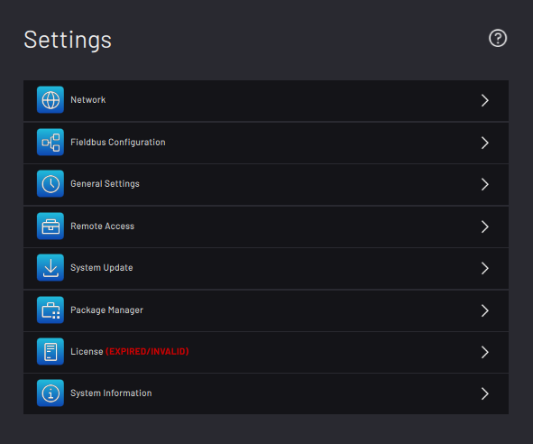
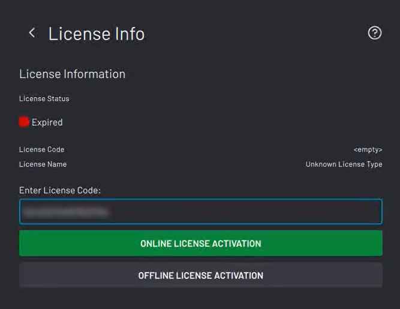
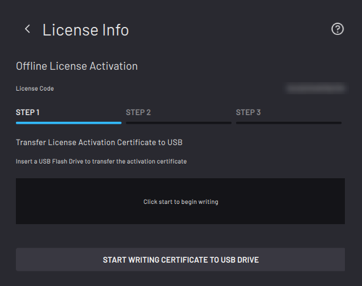
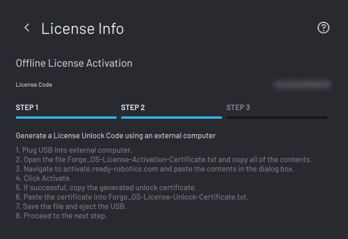
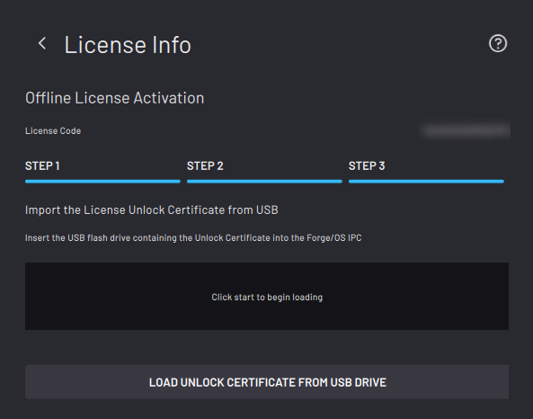

# Activating ForgeOS with a License Code

There are two methods to activate ForgeOS: **Online license activation** and **offline license activation**.

Below are the requirements for each method.

**Online License Activation:**
-   An internet-connected ForgeOS
-   A valid ForgeOS license code

**Offline License Activation:**
-   A 2GB or larger USB flash drive
-   An internet-connected PC
-   A valid ForgeOS license code

:::tip
Connect a USB keyboard to the port on the bottom of the READY pendant to type in any text field in ForgeOS.
:::

---

1. On the Settings app main screen, tap **License**.

2. Type in your license code.

3. Choose **ONLINE LICENSE ACTIVATION** if ForgeOS is connected to the internet. If not, choose **OFFLINE LICENSE ACTIVATION**.

---

If you chose online license activation, you're done!

If you chose offline license activation, follow these steps:

4. Insert the USB flash drive into your IPC. Tap **START WRITING CERTIFICATE TO USB DRIVE**.

5. When the files finish transferring, tap **NEXT**. Follow the instructions on the screen to convert the Activation Certificate to an Unlock Certificate using an internet-connected PC.

6. Insert the USB flash drive back into your IPC. Tap **UNLOAD UNLOCK CERTIFICATE FROM USB DRIVE**.

7. Wait for the file to finish transferring. When the file transfer is complete, remove the USB flash drive and tap **SAVE**.

---

ForgeOS returns to the licensing home screen and shows an active license. If the license status isn't active, restart these license activation steps. Double-check your license code.

