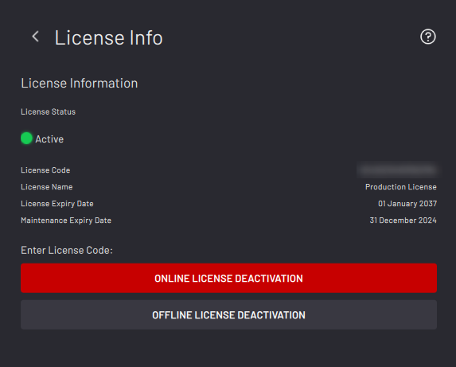
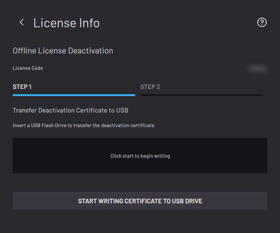
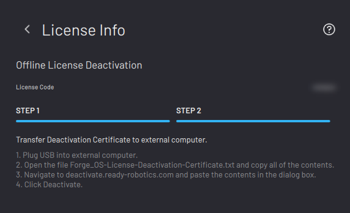

# Deactivating ForgeOS with a License Code

To transfer a ForgeOS license from one machine to another, first deactivate the license. Then activate it on the new machine.

There are two methods to deactivate ForgeOS: **Online license deactivation** and **offline license deactivation**.

Below are the requirements for each method.

**Online License Deactivation:**
-   An internet-connected ForgeOS

**Offline License Dectivation:**
-   A 2GB or larger USB flash drive
-   An internet-connected PC

On the Settings app main screen, tap **License Info**.

Choose **ONLINE LICENSE DEACTIVATION** if ForgeOS is connected to the internet. If not, choose **OFFLINE LICENSE DEACTIVATION**.

In the pop-up, tap **DEACTIVATE** to confirm that you want to deactivate your license.

If you chose online license deactivation, you're done!

If you chose offline license deactivation, follow these steps:

Insert the USB flash drive into your IPC. Tap **START WRITING CERTIFICATE TO USB DRIVE**.

When the files finish transferring, tap **NEXT**. Follow the instructions on the screen to finish deactivating the license using an internet-connected PC.

Tap **FINISH**.

ForgeOS returns to the licensing home screen and shows an inactive license. If the license status isn't inactive, restart these license deactivation steps.

