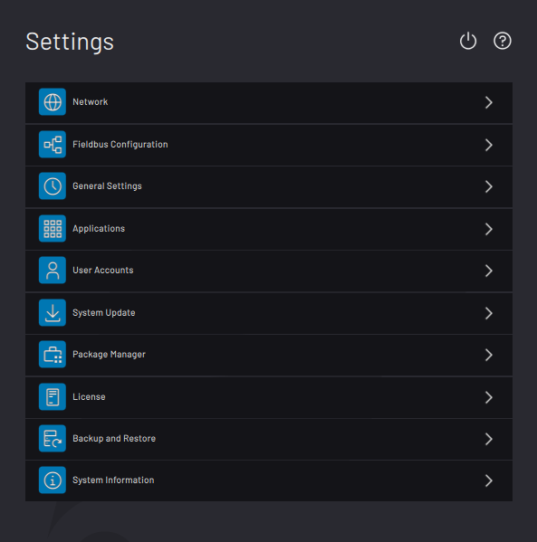

# Deactivating ForgeOS with a License Code

To transfer a ForgeOS license from one machine to another, first deactivate the license. Then activate it on the new machine.

There are two methods to deactivate ForgeOS: **Online license deactivation** and **offline license deactivation**.

The table below lists the requirements for each method.

|Online License Deactivation|Offline License Dectivation|
|---------------------------|---------------------------|
|-   An internet-connected ForgeOS

|-   A 2GB or larger USB flash drive
-   An internet-connected PC

|

**Note:** If you are unable to deactivate a ForgeOS license, contact READY Robotics Support.

1.  On the Settings app main screen, tap **License Info**.

    

2.  Choose **ONLINE LICENSE DEACTIVATION** if ForgeOS is connected to the internet. If not, choose**OFFLINE LICENSE DEACTIVATION**.

    

3.  In the pop-up, tap **DEACTIVATE** to confirm that you want to deactivate your license.

4.  If you chose online license deactivation, you're done!

5.  If you chose offline license deactivation, follow these substeps:

    1.  Insert the USB flash drive into your IPC. Tap **START WRITING CERTIFICATE TO USB DRIVE**.

        

    2.  When the files finish transferring, tap **NEXT**. Follow the instructions on the screen to finish deactivating the license using an internet-connected PC.

        

    3.  Tap **FINISH**.

    4.  ForgeOS returns to the licensing home screen and shows an inactive license. If the license status isn't inactive, restart these license deactivation steps.

**Parent topic:**[License Information](../Settings/LicenseInfo.md)

