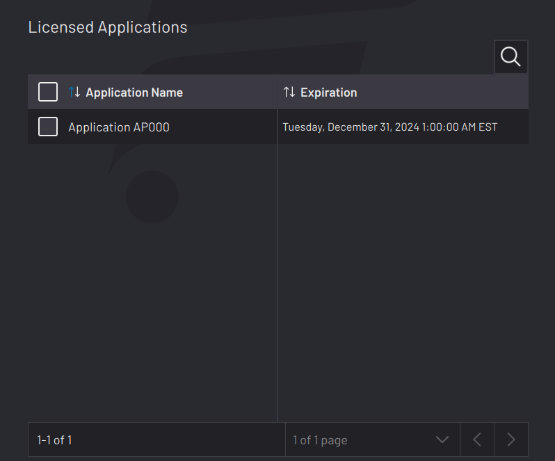

# License Information

The License Information screen shows the status of your ForgeOS license. If the license is active, the page shows the license code. If it’s your first time booting ForgeOS, you are taken directly to this page to activate ForgeOS.

See [Activating Forge/OS with a License Code](LicenseInfo-Activation.md) for license activation steps.

See [Deactivating ForgeOS with a License Code](LicenseInfo-Deactivation.md) for license deactivation steps.

:::info
READY can use a web portal to enable a list of applications to appear in the **Licensed Applications** table according to your specific license code. This table will update upon license activation. If a license is already active, the table will update upon license deactivation and reactivation. Once applications appear in the table, sort them by name or expiration date.

:::

