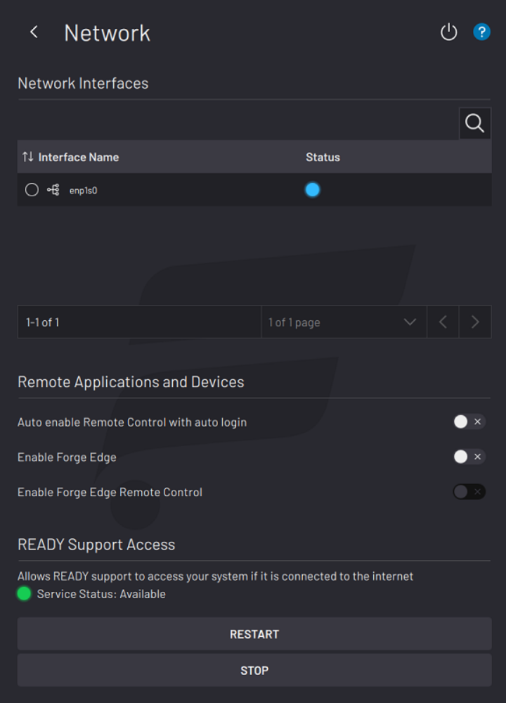

# Network

The Network screen is where you control network-related settings.

In the **Network Interfaces** table, view and edit Wi-Fi and Ethernet interfaces on your IPC.

In the **Remote Applications and Devices** section, toggle on **Auto enable Remote Control** to automatically begin in Remote Control mode when ForgeOS restarts.

:::info
Robots that do not require hardware switching between Teach and Run mode \(such as keyless robots and some cobots\) will always start up in Run mode after a ForgeOS restart. This allows for a smooth integration with Remote Control mode.
:::

**Forge Edge** opens the door for creating custom web-based apps for ForgeOS. If you toggle on **Enable Forge Edge** and set up a network connection to your computer, you can collect real-time data of your ForgeOS system.

:::caution
For security reasons, the Forge Edge toggle is disabled by default. It is your responsibility to ensure that you trust any network that you connect the ForgeOS system to \(e.g., deploy within an isolated LAN or a VPN\) and that you follow all safety guidelines in your robot OEM manual.
:::

If you additionally toggle on **Enable Forge Edge Remote Control**, you can remotely control ForgeOS from the web interface. This allows you to do things like load and start Task Canvas tasks directly from your computer.

:::info
For more information about how to set up a network connection to your computer, how to launch Forge Edge, and how to give web-based apps created with Forge Edge access to your ForgeOS instance, refer to the READY Robotics website.
:::

The **READY Support Access** section is where you enable remote access for READY Robotics Support to service or troubleshoot your system. First connect your system to the Internet, then use the controls to stop and restart access for remote connection.
