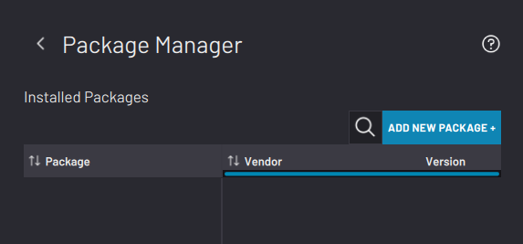
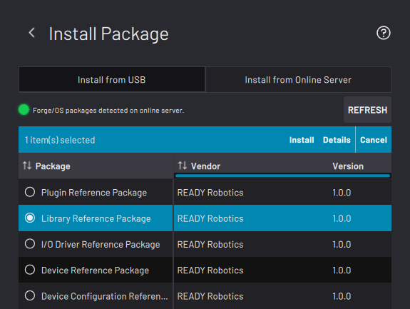
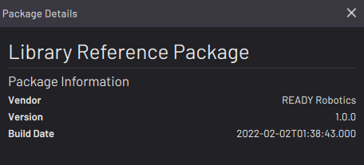
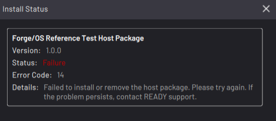
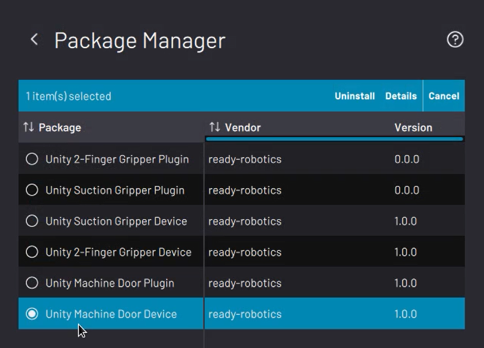
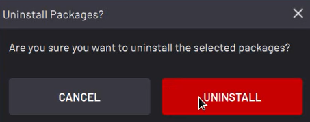

# Package Manager

The **Package Manager** is where you install new software components from the Cloud or from a USB flash drive without requiring a new full build of ForgeOS. Components are "packaged" to contain all relevant software and configuration templates. Packages are digitally signed and verified for security and authenticity.

**Note:** If you are a third-party SDK Developer, send your packages to READY Robotics to have them reviewed, tested, and signed before distribution.

Only Admins can manage installed packages, but Operators can still use a package \(if the package permits that\).

Listed below are the different package types:

-   **Application**: A package that installs a new app into ForgeOS. The app will have one or more icons present on the Home screen.

-   **Device**: A package that installs a new device into ForgeOS. The device will appear as a configurable device in the Device Configuration app. Appearance or use in other apps depend on the content of the package. For example, a device may have additional plugin components for the Device Control app and Task Canvas app.

-   **Device Configuration**: A package that provides a set of configuration JSON files that customize a device for a specific company and/or product.

-   **I/O Driver**: A package that provides access to an IO communication bus \(such as an item that appears under "Fieldbus" in Settings\).

-   **Library**: A package that includes libraries and files that other packages can use.

-   **Plug-in**: A package that contains a shared object to extend the functionality of a ForgeOS application \(such as new Task Canvas blocks\).

In addition to installing packages inside the Forge container, you may install “host packages”. **Host packages** are packages that are installed directly on the host IPC. Decoupled from the Forge platform release process, host packages open the door for many large-scale applications.

Streamline the package installation process with “package bundles”. Instead of having to install several packages individually, **package bundles** allow you to install multiple packages at once with a single install request.

|The main Package Manager screen shows a table of installed packages.

Tap **ADD NEW PACKAGE +** to install a new package.

||

|Tap the **Install from USB** tab if you are installing a package from a USB flash drive that you plugged into your IPC.

Tap the **Install from Online Server** tab if ForgeOS is connected to the internet and you are installing a package from the Cloud.

Select a package from the list and tap **Install** in the table header.

||

|Tap **Details** in the table header to view more information about the selected package.

||

|Check the status of the package installation and removal process with the “Install/Uninstall Status” pop-up. In the case of failure, this pop-up displays an error code and details. For example, you will be warned if there's not enough storage space available before installation begins.**Tip:** If you are installing a package from a USB flash drive, make sure that the USB was safely ejected from the PC it got the file from.

||

|If no errors occur during installation, the new package appears in the Package Manager main screen.

To uninstall a package, select it and tap **Uninstall** in the table header.

 **Note:** Previously-existing instances of a package will be automatically removed prior to the installation of the new version.

||

|In the pop-up, tap **UNINSTALL** to confirm the package uninstallation.

||

**Parent topic:**[Settings](../Settings/SettingsOverview.md)

