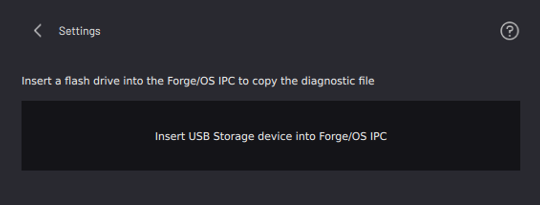
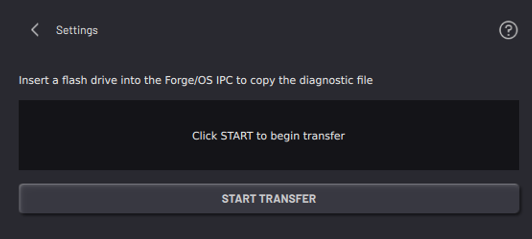
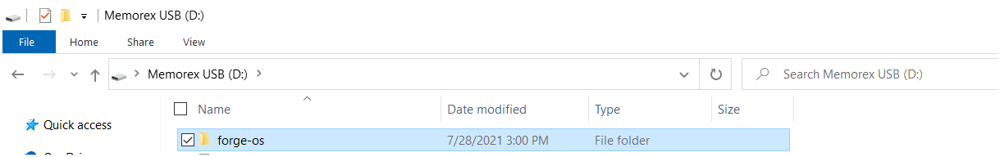
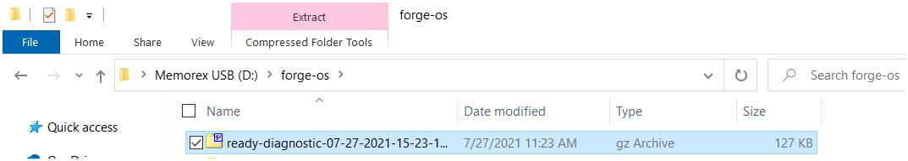

# Creating a System Diagnostic File

Follow these steps to create system diagnostic information when you have a problem with your system. Send the files to READY Robotics Support for help.

1.  In the System Information menu, tap **CREATE SYSTEM DIAGNOSTIC FILE**.

2.  Insert a 2GB or greater USB flash drive into your IPC.

    

3.  Once ForgeOS detects the USB flash drive, tap **START TRANSFER**.

    

4.  Once the file transfer is complete, remove the USB flash drive from your IPC. Insert it into another computer.

5.  In the USB storage, go to the newly generated "forge-os" folder.

    

6.  Find the "ready-diagnostic..." archive folder. Send this folder to READY Robotics Support with a description of the issues you are experiencing.

    

**Parent topic:**[System Information](../Settings/SystemInfo.md)

