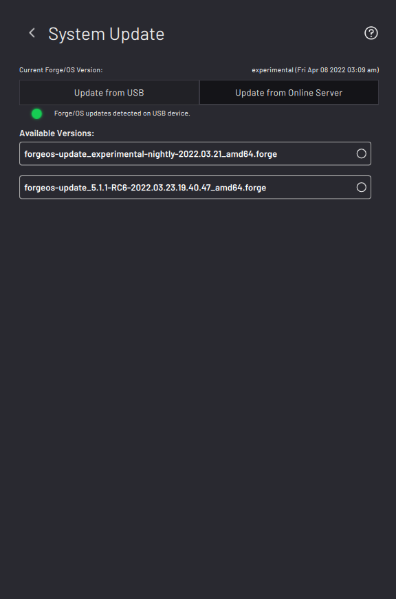
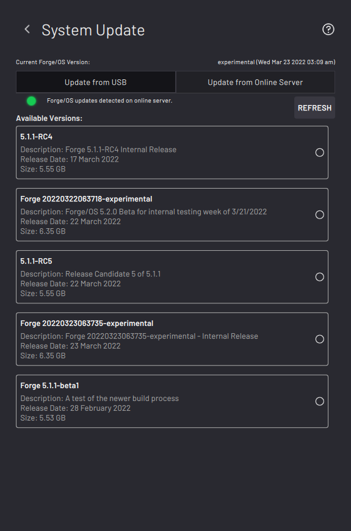

# System Update

The System Update screen is where you update ForgeOS from a USB flash drive or an online server.

|Update from USB|Update from Online Server|
|---------------|-------------------------|
|

|

|

|To update with a USB flash drive, download the update file to your USB drive and insert it into your IPC.

In the **Update from USB** tab, tap the available version that you want to update to.

**Note:** You must have an eligible Support plan to receive an update file. Update files are too large for the FAT32 file system.**Use an exFAT formatted USB flash drive with at least 8GB of storage**.

**Important:** After you transfer an update file to your USB flash drive, make sure you safely eject it from your computer. Early removal of the USB flash drive will corrupt the update file.

|To update with an internet-connected server, go to the **Update from Online Server** tab. Tap the available version that you want to update to.

**Available online updates are based on the system's current version.** They include:

-   Most recent version of ForgeOS.
-   Most recent minor version of the system major version.
-   Most recent patch of the system version.

For example, if the system version is 5.3.0 and the latest version is 6.1.1, the options will be something like this:

-   6.1.1 \(latest version of ForgeOS\)
-   5.6.2 \(last version in 5.x\)
-   5.3.3 \(last version in 5.3.x\)

|

Wait about 20 minutes for the update to finish installing. When it is done, a pop-up asks if you want to restart now or later. Tap **Restart Now** to finish applying the update.

**Tip:** After you log back in, verify that the update completed successfully by checking the **Current ForgeOS Version** in the top-right corner of the **System Update** page or **System Information** page.

**Important:** You may need to update robot configuration files. Refer to READY's "How to Update ForgeOS" guide.

**Parent topic:**[Settings](../Settings/SettingsOverview.md)

