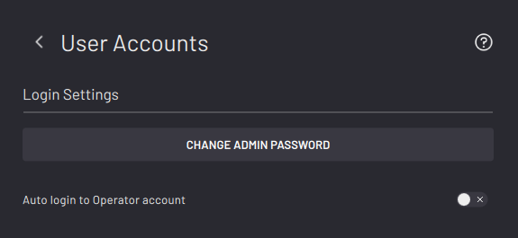

# User Accounts

|The User Accounts screen is where you set login settings.

||

|The default Admin password is “forgeadmin”. You must change this password when setting up ForgeOS. You can change it again any time later on by tapping **CHANGE ADMIN PASSWORD**.

Enter the current password, enter the new password, then enter the new password again to confirm it.

To save, tap **CHANGE PASSWORD**.

**Note:** If you forget your password, contact READY Robotics Support to reset it.

||

If you enable **Auto login to Operator account**, ForgeOS automatically signs in to the Operator profile when ForgeOS restarts. An Admin can then access the Admin profile by logging out of the Operator profile through the bottom Taskbar.

**Parent topic:**[Settings](../Settings/SettingsOverview.md)

