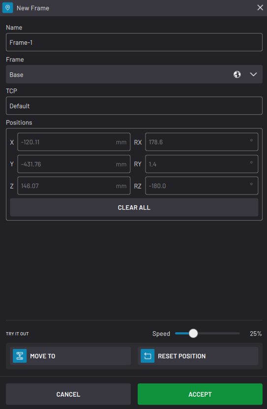

# Create and Manage Frames

**Frames** are Cartesian reference frames for moving the robot and defining **Waypoints**. Every robot has a default Base frame and TCP frame. You can also create custom 1-point or 3-point frames.

| |Base Frame|TCP Frame|Custom Frame|
|--|----------|---------|------------|
|Image||||
|Location|The base of the robot|The active Tool Center Point \(TCP\)|Wherever you define, relative to the Base frame or another custom frame|
|Can you use it to define Waypoints?|Yes|No|Yes|
|Can you use it to define Frames?|Yes|No|Yes|
|Can you view it in the Device Control app?|Yes|Yes|If you make the frame "Global" in the Frame Manager|

Why use custom frames? Custom frames allow you to define a new coordinate system along an inclined tray, workbench, grid, or more! Here are the differences between 1-point frames and 3-point frames:

| |1-Point Frames|3-Point Frames|
|--|--------------|--------------|
|Description|Define a 3D coordinate system based on the position and orientation of the TCP.|Define a 3D coordinate system based on three positions of the TCP.|
|How do you create one?|Define with values or position the TCP at the "Origin" you want with each of the TCP axes pointing along the desired X, Y, and Z axes.|Position the TCP at the "Origin", the "X point", then the "Y point" \(OR\) Choose existing waypoints to define the "Origin", the "X point", then the "Y point".|
|What are the advantages?|Because 1-point frames only reference one position, they are slightly faster to create.|Because 3-point frames reference three positions, they are much more accurate.|

## Frame Manager

Use the **Frame Manager** to create and manage custom frames for the selected robot.

**Note:** The Base and TCP frames are not in the Frame Manager. You cannot modify or remove them.

|Some frames have icons to the right of their name to show what type of frame it is:

-   **1-Point Frame**: No icon
-   **3-Point Frame**: Coordinate system icon with the number "3"
-   **Global 1-Point Frame**: Globe icon
-   **Global 3-Point Frame**: Globe icon and the coordinate system icon with the number "3"

||

|To create a new frame, tap **NEW +** at the top of the table. Decide if you want to create a **1-POINT FRAME** or a **3-POINT FRAME**.

||

|To create a 1-point frame, follow these steps:

 1.  Enter a **Name**.
2.  Choose a **Frame** from which to define the new frame. Except for special cases, select the **Base** frame.
3.  If the active TCP is not the TCP that you want to use, switch to a different one in the Device Control app.
4.  In the Device Control app, move the TCP to the desired location of the new frame. In the New Frame pop-up, the **Positions** fields automatically fill in with the TCP's current position. Alternatively, directly type values into the **Positions** fields.
5.  Tap **ACCEPT** to save the frame.

||

|To create a 3-point frame, follow these steps:

 1.  Enter a **Name**.
2.  Choose a **Frame** from which to define the new frame. Except for special cases, select the **Base** frame.
3.  If the active TCP is not the TCP that you want to use, switch to a different one in the Device Control app.
4.  In the Device Control app, move the TCP to the desired **Origin** of the new frame and tap **RECORD CURRENT POSITION**. Alternatively, tap **FROM EXISTING POSITION** to use an existing waypoint for the Origin position.
5.  Repeat the above step for the **X point** and **Y point**.
6.  Once there is a checkmark next to the Origin, X point, and Y point fields, tap **ACCEPT** to save the frame.

||

|To make one or more frames global, select them and tap **Make Global** at the top of the table. A global frame is accessible to other tasks and apps \(including the Device Control app\). If you change a global frame, it changes everywhere.

 **Important:** Once you make a frame global, you cannot make it local again. However, you can create a local duplicate of a global frame.

||

To reassign the defining frame for selected frames, tap **Reassign Frame**.

**Note:** Re-assigning the frame changes the defining frame WITHOUT changing the frame's position. For example, if you change Frame-2's defining frame to be Frame-1 instead of Base, Frame-2's position will not change. Frame-2's position will change if you modify the coordinates of Frame-1.

To edit a frame \(change its name or orientation\), select it on the table and tap **Edit**. You can only edit one frame at a time.

To remove one or more frames from the task, select them on the table and tap **Delete**. A prompt asks you to confirm before deleting them.

To make a copy of one or more frames, select them on the table and tap **Duplicate**. If you are duplicating a global frame, choose if you want the copy to be local or global. The copy’s name will end with “-copy” to avoid name collision.

To delete all unused frames, select none of the frames and tap **Clear Unused** at the top of the table. A prompt lists all the unused local variables and asks you to confirm before deleting them. Unused frames are frames with zero waypoint references.

At the bottom of the manager, use the **TRY IT OUT** section to preview a selected frame. Tap**MOVE TO** to move the TCP to the selected frame. Drag the **Speed** slider to determine how fast the robot moves. Tap **RESET POSITION** to move the robot to the position it was in when you opened the Frame Manager.

**Parent topic:**[Data Management](../TaskCanvas/DataManagement.md)

