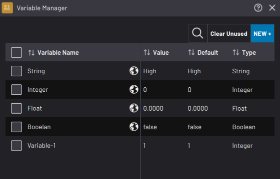
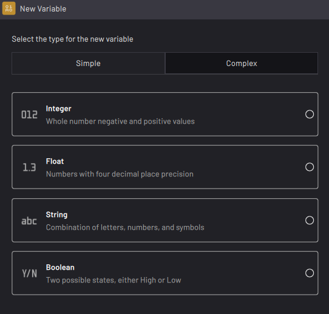
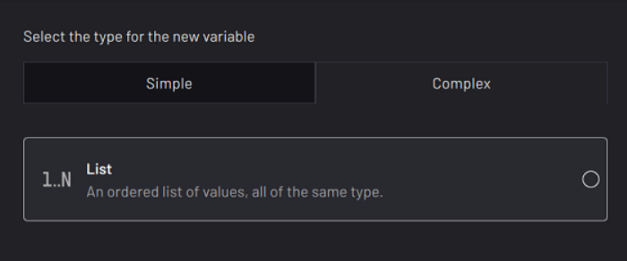
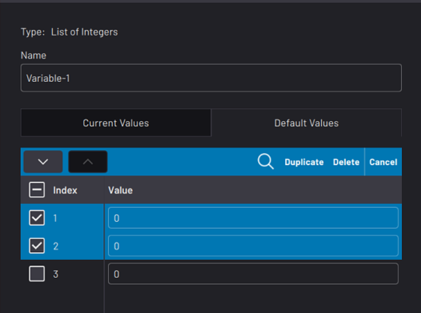
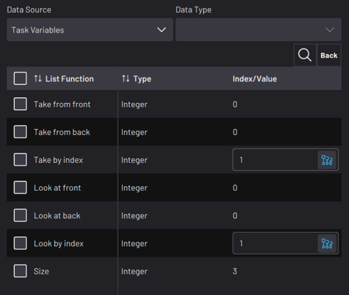
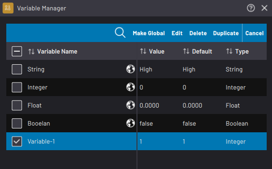
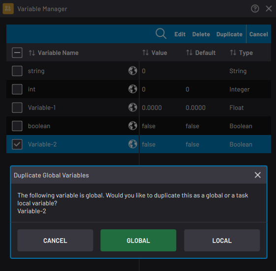

# Create and Manage Variables

**Variables** store and transmit values between blocks and devices. Use variables for decision-making with **Check** blocks. Use **Set** and **User Input** blocks to change variable values. Four types of variables are possible:

|Type|Description|
|----|-----------|
|Boolean|"True" or "False"|
|Integer|Positive and negative whole numbers, including zero \(i.e. 7\)Min/max values are: -2147483648 and +2147483647|
|Float|Positive and negative numbers up to 5 decimal places \(i.e. -108.64\)Min/max values are: -3.4028E+38 and +3.4028E+38|
|String|Alphanumeric text value \(i.e. 'Hello world'\) Maximum character length is 255 characters|

Enter a variable into compatible block parameters so the block uses the variable when it executes. For example, use a variable in the distance field in a robot Relative Move block or the seconds field in a Wait block. If the variable changes somewhere in the task, these blocks may behave differently each time they execute.

:::note
Variables are unitless in Forge/OS. The parameter field determines the unit.
:::

## Variable Manager

Use the **Variable Manager** to create and manage variables. Listed for each existing variable are its **Name**, current **Value**, **Default Value**, and **Type**.

:::note
The **Value** is what you or the task last set the variables to. The **Default** value is what task variables reset to when you tap **Reset States** or **Reset All to Start**.
:::

To delete all unused variables, select none of the variables and tap **Clear Unused** at the top of the table. A prompt lists all the unused local variables and asks you to confirm before deleting them. Unused variables are variables with zero block references.

To add a new variable, tap **NEW+** at the top of the table. Select which type of variable you want to create, then enter that variable’s information.

:::caution
Once you create a variable, you can't change the type of variable it is.
:::

---

In the **Complex** tab, add a list variable for advanced applications. A **list variable** is a series of one or more values of a chosen sub-type \(i.e., integer, float, string, or boolean\).

Each sub-type item has a current Value and a Default value. The first item in the list has an index of “1”, the second item has an index of “2”, etc. Change the order by selecting one or more items and pressing the up or down arrows. In the **Default Values** tab, copy the list from the **Current Values** tab by selecting no entries and then tapping **Copy From Current** in the table header.

Using the variable selector in various pop-ups, you may call a list variable in its entirety or any index from it. Depending on the context of the variable selector, you will either be presented with "Use" functions or "Set" functions. 

-   **Use functions** are available in places like the Check block. These functions include "take" and "look".

-   **Set functions** are available in places like the Set block. These functions include "add", "insert", "overwrite", "merge", and "truncate".

|"Use" Function|Description|
|--------------|-----------|
|Take from front|The current value of the first item in the list is evaluated. Immediately afterwards, that item is removed from the list. The items below it move up to fill the space, and the list size reduces by 1.|
|Take from back|The current value of the last item is evaluated. Immediately afterwards, that item is removed from the list. Other items in the list do not move position, and the list size reduces by 1.|
|Take by index|The current value of the identified item in the list is evaluated. Immediately afterwards, that item is removed from the list. The items below it move up to fill the space, and the list size reduces by 1.|
|Look at front|The current value of the first item in the list is evaluated. No items are removed, and the list size does not change.|
|Look at back|The current value of the last item in the list is evaluated. No items are removed, and the list size does not change.|
|Look by index|The current value of the identified item in the list is evaluated. No items are removed, and the list size does not change.|
|Size|This integer value represents the number of items in the list.|

|"Set" Function|Description|
|--------------|-----------|
|Add to front|The item being set gets added to the first postion. The other items move down.|
|Add to back|The item being set gets added to the "N+1" position. The other items do not move.|
|Insert by index|The item being set gets added to the selected index position. The other items below it move down.|
|Overwrite by index|The item being set gets added over the selected index position. The other items do not move.|
|Merge from list|The items in one list get added to the end of another list.|
|Truncate|This integer value represents the desired number of items in the list to cut down to. If the entered value is smaller than the list's "Size", items at the bottom of the list are removed. If the entered value is equal to or greater than the list's "Size", no action is taken.|

---

To access a variable in other tasks and in the [Parameter Manager](../ParameterManager/GlobalUserVariables.md), select it on the table and tap **Make Global**. A pop-up asks you to confirm your decision.

:::caution
Once you make a variable global, you cannot make it only local again. However, you can create a local duplicate of a global variable.
:::

To edit a variable, select it on the table and tap **Edit**. You can rename the selected variable, change its current value, or change its default value. You cannot change the variable's type.

To remove one or more variables, select them and tap **Delete**. A prompt asks you to confirm before deleting them.

To make a copy of one or more variables, select them on the table and tap **Duplicate**. If you are duplicating a global variable, choose if you want the copy to be local or global. The copy’s name will end with “-copy” to avoid name collision.

