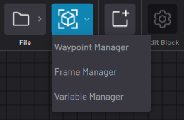

# Data Management

The Canvas Data menu is where you modify data used by blocks in the task, including robot positioning data and variables.

-   **[Create and Manage Waypoints](../TaskCanvas/CreateAndManageWaypoints.md)**  

-   **[Create and Manage Frames](../TaskCanvas/CreateAndManageFrames.md)**  

-   **[Create and Manage Variables](../TaskCanvas/CreateAndManageVariables.md)**  

**Parent topic:**[Task Canvas](../TaskCanvas/TaskCanvasOverview.md)

