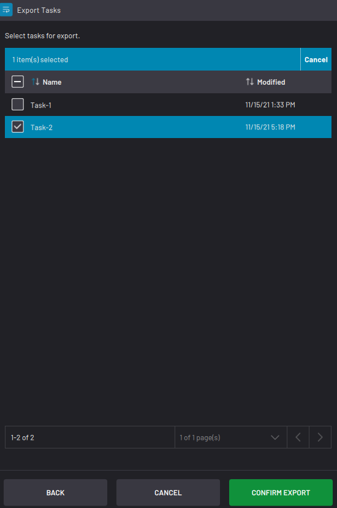

# Exporting Tasks

Exported tasks include all local and global parameters used in the task. The exported file is a copy, so the original file stays on the READY pendant.

Plug the USB flash drive into your IPC.Once the system detects your USB flash drive, tap **NEXT**. Select the task\(s\) you want to export. Then tap **CONFIRM EXPORT**. Once the export is complete, tap **FINISH**. Remove the USB flash drive.

|||

**Parent topic:**[Load Task](../TaskCanvas/LoadTask.md)

