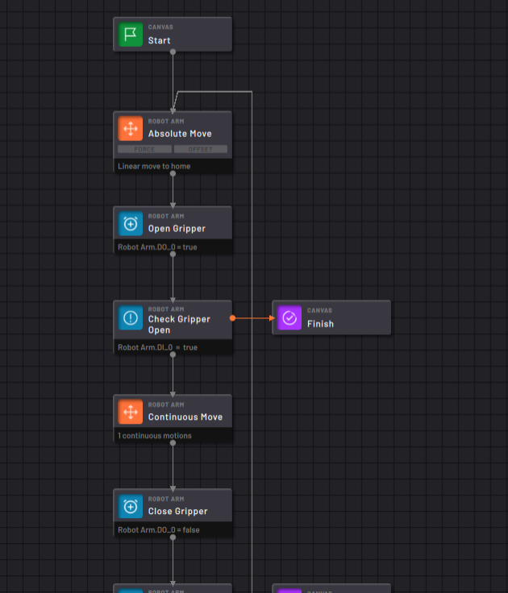
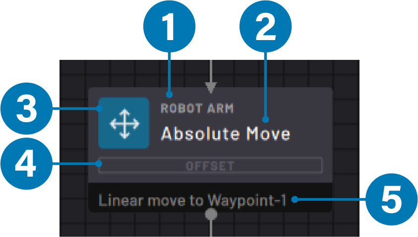
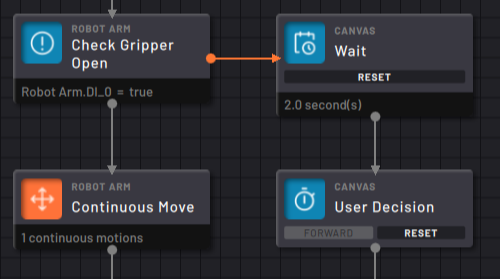
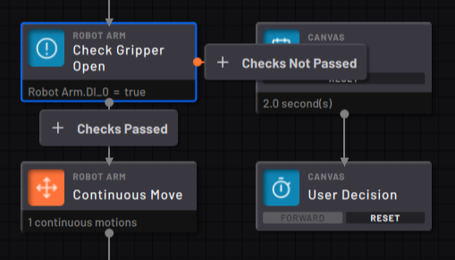
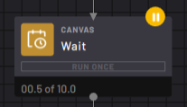
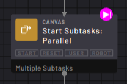
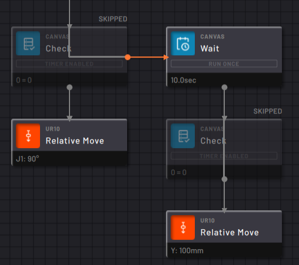
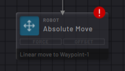

# Features of a Task

Create a **task** by combining blocks into a **flowchart**. Create additional flowcharts as **subtasks** to execute functions inline or at the same time as the main task. For more information about subtasks, see [Multitasking with Subtasks](MultitaskingWithSubtasks.md).

Every flowchart begins with a **Start** block and follows the path of execution. Task Canvas performs each block's function before moving on to the next block. A flowchart ends with a **Finish** block or when there are no more blocks to execute.

## Blocks

Each block is a function that Task Canvas executes. On the Canvas, a block displays several pieces of important information:

|No.|Block Information|Description|
|---|-----------------|-----------|
|1|Device|The device that owns the block and receives the command when the block executes.|
|2|Block Name|The name given to the block. By default, each block is named after its block type or function. Rename blocks for reference while programming a task.|
|3|Block Type \(Icon\)|Shows the type of block for quick reference. Icons and colors depend on the block type and device type.|
|4|Modifiers|Any internal settings that change the way the block executes. Highlighted white if the block uses the modifier.|
|5|Execution State or Parameters|If the block is state-based \(e.g., Timer, Count, Grid Move\), this shows the execution state of the block. If the block isn't state-based \(e.g., Absolute Move or Set\), this shows the parameters that the block uses to execute.|

In the image above, the block device is "ROBOT ARM". The block name and function is "Absolute Move". There is no Force modifier available because there is no force sensor configured for that robot. The Offset modifier isn't highlighted because there are no offset values entered. The parameter defining where the robot moves to is "Waypoint-1".

## Program Paths

Paths connect blocks together to form the flowchart. Each block may have one or more paths leading to it. The number of possible exit paths from a block depends on the type of block.

Some blocks have two possible outcomes: a bottom gray path or a right orange path. Other blocks have one possible outcome: the bottom gray path.

See the images below for an example. The block named "Check Gripper Open" connects to the Continuous Move block through the bottom gray path and to the Wait block through the right orange path. In this case, the Check Gripper Open block is checking the state of gripper sensors. It follows the gray path if the gripper is open \(Checks Passed\) or it follows the right orange path if the gripper is closed \(Checks Not Passed\).

|||

When you place a new block on the exit path of an existing block, Task Canvas creates the path connecting them. For information on how to create loops, disconnect paths, or reconnect paths, see [Block Programming](BlockProgramming.md).

## Special Block States

|An incremental or robot motion block that was stopped midway through its execution displays a yellow **paused** icon. Press the **Last Executed** button in the Canvas Navigation menu to select and center the screen on the paused block.

||

|If the last block that was executed finished its execution when stopping \(or stepping through\) a task, it displays a magenta**Last Executed** icon. Press the **Last Executed** button in the Canvas Execution menu to select and center the screen on the last executed block.

||

|A block that can't be traced back to the Start block through paths is a**Detached block**. You can modify and step Detached blocks, but they don't execute as part of a task since there is no path to them on the flowchart. Add a Detached block back to the task by connecting a path to it.

||

|If you don't want your task to execute a block, but you're not ready to delete it, skip the block. A **Skipped block** stays connected to the flowchart, but it is passed over during task execution. Choose to skip to an available bottom or right path. Restore a block by tapping Unskip in the Block Editor.

||

|A block that is missing a key parameter or device needed to execute is a **Template block**. A template block appears transparent with a red exclamation point. Template blocks can prevent the task from executing until you **Skip** them.

Tap the red exclamation point to view the block's error message. Tap **BACK TO BLOCK** to center the screen on that template block. Tap **X** to close the error message.

||

To restore a Template block:

-   Fill in the missing parameters in that block settings.
-   Enable the referenced device in Device Configuration.
-   Remap the missing device to another device in [Task Settings](TaskSettings.md).

**Parent topic:**[Task Canvas](../TaskCanvas/TaskCanvasOverview.md)

