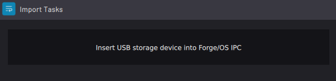
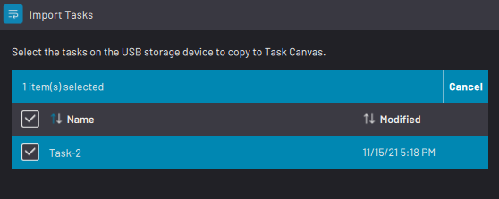
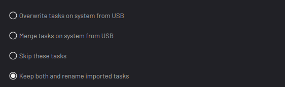
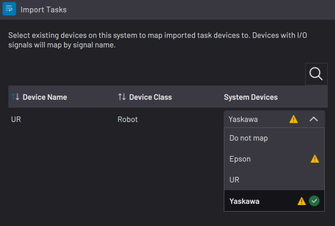
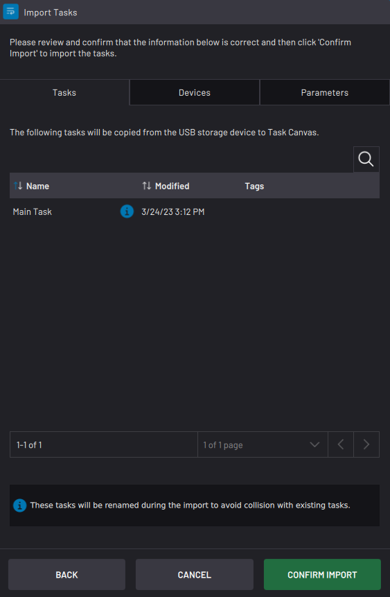

# Importing Tasks

Imported tasks include all local and global parameters used in the task. The imported file is a copy, so the original file stays on the USB flash drive.

There are two types of formats that you can import:

-   Task files \(that end in “.task”\)

-   FTL files \(that end in “.ftl”\)

## Importing Task Files

Select **Import Task\(s\) from USB** to import tasks that were normally programmed on a READY pendant and exported to a USB drive.

|Plug the USB flash drive with your ".task" file\(s\) into your IPC. Once the system detects your USB flash drive, tap **NEXT**.||

|Select the task\(s\) you want to import. Then tap **NEXT**.||

|If Task Canvas already has tasks or autosaved tasks with the same names as files that you are trying to import, choose if you want to overwrite the tasks on the system, merge the tasks, skip those tasks, or import the new tasks with “-copy” added to the end of the names.||

|Use the **System Devices** dropdowns to map the task's devices to your system's configured devices. The remapped device must be of the same device class \(e.g., robot, gripper, sensor, etc.\) as the original device. Then tap **NEXT**.

 **Important:** If you are remapping to a different type of robot, update waypoints in the task's Waypoint Manager to avoid collisions, singularities, or joint limits. Some parameters \(such as Set blocks for robot I/O\) may require manual reassignment in that block's settings.

||

|If the ForgeOS system already has parameters with the same names as parameters that you are trying to import, choose if you want to overwrite the parameters on the system, skip those parameters, or import the new parameters with “-copy” added to the end of the names.||

|Review the information in the **Tasks**, **Devices**, and **Parameters** tabs.

 Tap **BACK** if you need to make any changes.

 If everything looks correct, tap **CONFIRM IMPORT**.

 Once the import is complete, tap **FINISH**. Then remove the USB flash drive.

||

## Importing FTL Files

**FTL** stands for “**Forge Task Language**”. FTL is a JSON specification that provides a common API for creating Task Canvas tasks. Select **Import Task\(s\) in FTL format from USB** to import tasks that were programmed by READY or by third-party developers from any programming language and exported to a USB drive.

FTL merges imported tasks into existing tasks by overwriting locked subtasks and ignoring unlocked subtasks. For more info on locked and unlocked subtasks, see “[Multitasking with Subtasks](MultitaskingWithSubtasks.md)”.

**Parent topic:**[Load Task](../TaskCanvas/LoadTask.md)

