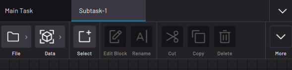
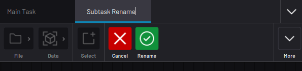
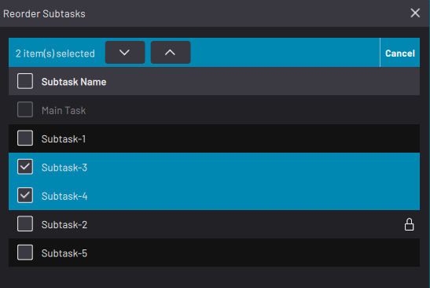
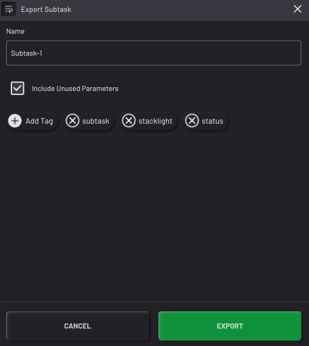
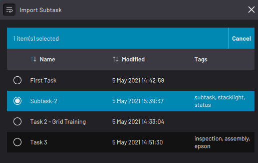
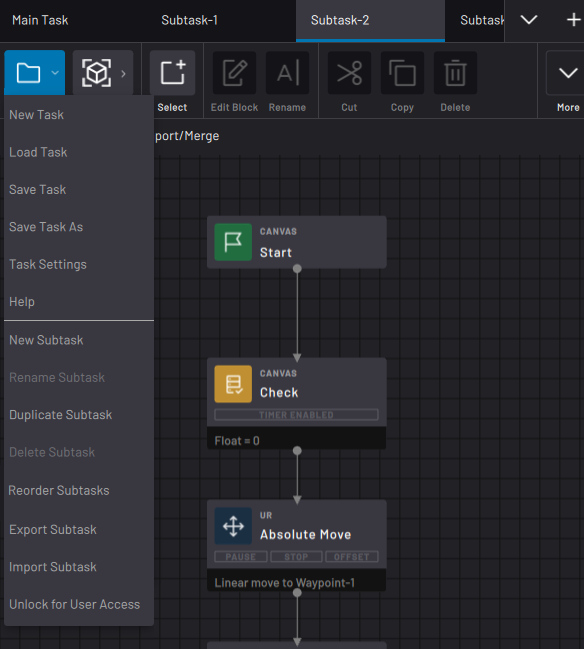
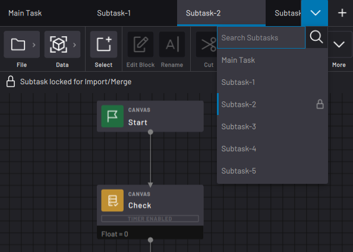

# Multitasking with Subtasks

Task Canvas lets you create more than one canvas within a single task. Each of these canvases, or **subtasks**, has its own flowchart that can run inline or parallel to your **Main Task**. Use subtasks to multitask or to organize blocks into a functional group.

-   A **parallel subtask** starts when a **Start: Parallel** block executes. The parallel subtask executes as the Main Task continues to run.

-   An **inline subtask** starts when a **Start: Inline** block executes. The inline subtask executes its entire flowchart before the Main Task continues to run. An inline subtask returns control to the calling task through an **Exit** block. The Exit block decides if the calling subtask moves on to the bottom path or the right path from the Start: Inline block.

Some devices can execute commands across parallel subtasks, such as setting a digital output or variable value.

Some devices, including robots, can only receive a command from one flowchart at a time. For those devices, the block in one subtask queues and waits for the executing block in another to finish.

---

To add a subtask, tap **New Subtask** in the File menu. A new canvas appears for you to create the subtask flowchart.

---

To rename a subtask, open the subtask you want to rename and select **Rename Subtask** in the File Menu. Type in the new name and then tap the green Rename checkmark in the top menu.

---

To duplicate a subtask, open the subtask you want to copy and select **Duplicate Subtask**.

---

To delete a subtask, open the subtask you want to delete and select **Delete Subtask**.

:::note
You cannot delete the Main Task.
:::

---

To change the order that the subtasks appear in the taskbar, tap **Reorder Subtasks**. In the pop-up, select one or more subtasks and tap the up/down arrows. **Note:** You cannot change the position of the Main Task.

---

To export a subtask to the Load Task screen, select **Export Subtask** in the File Menu. Name the subtask and enter tags for easier finding later. Select **Include Unused Parameters** to export all waypoints, frames, and variables with the subtask. If you don't select the **Include Unused Parameters** box, the exported file only contains waypoints, frames, and variables that are in use on the canvas.

To import a subtask into another task, open the new task and select **Import Subtask** in the File Menu. Find the subtask by name, select it, and tap **IMPORT**.

:::note
Changes that you make to the imported subtask do not affect the original file that you exported from.
:::

---

To prevent any subtask from being modified and to allow it to be overwritten by FTL imports/merges, tap **Lock for Import/ Merge**. A lock icon appears in the top-left corner of locked subtasks. Tap **Unlock for User Access** to undo this change. 

:::note
Subtasks are unlocked by default. Unlocked subtasks cannot be overwritten by FTL. For more info about FTL, see [Importing FTL Files](ImportTask.md).
:::

---

To navigate between subtasks, tap the down arrow in the top-right corner. From the dropdown, tap a subtask’s name to jump to that subtask’s flowchart. Locked subtasks have a lock icon in the dropdown.

