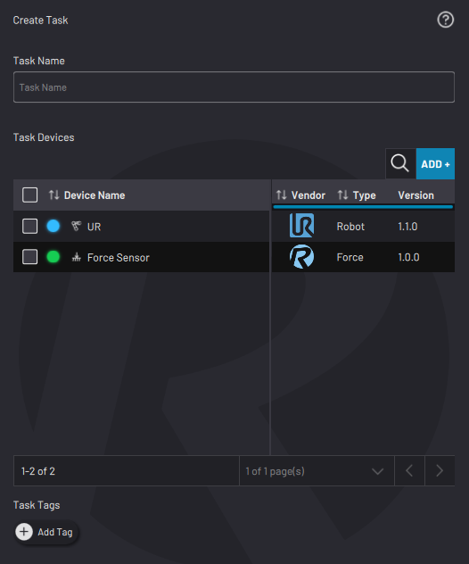
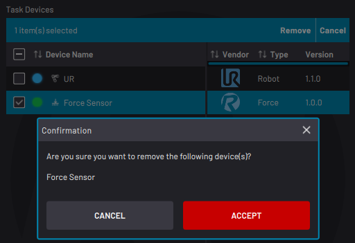
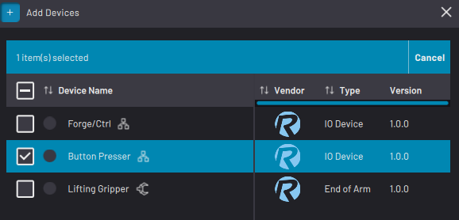

# New Task

To create a task, select **NEW +** from the Task Canvas Load Task screen or **New Task** from the File Menu.

|Give the task a unique name.

**Note:** Your task name cannot include one or more of the following characters: \` ~ ! \# %^ & \* \\ \| ' " : ; ? / < \>

The task will access all devices that are listed in the table.

By default, the device table includes all devices that are enabled in Device Configuration.

If you are using Remote Control mode, type in a **Remote Task ID** to allow the Remote Control Device to identify which task to load. The ID must be a unique, positive integer.

**Tip:** At the bottom, tap **Add Tag** to make the task easier to find later. When searching for the task, enter a tag to filter the search results.

||

|Create a task with no devices or with many.

Remove devices by selecting each unwanted device and tapping **Remove**.

**Note:** Tapping **Remove** here hides the selected device\(s\) from this task's list of devices. It does NOT remove the device\(s\) from the Device Configuration app.

||

|To add a device to the task, tap **ADD +**.Select the checkbox next to each device that you want to add and tap **ADD**.

**Note:** You can add or remove more devices later from [Task Settings](TaskSettings.md).

Tap **CREATE TASK**. ForgeOS directs you to a blank Canvas.

||

**Parent topic:**[Task Management](../TaskCanvas/TaskManagement.md)

