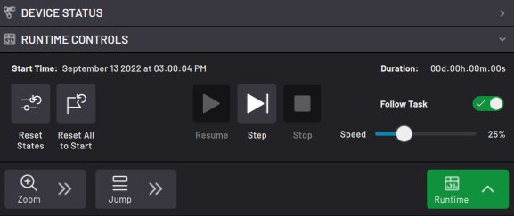
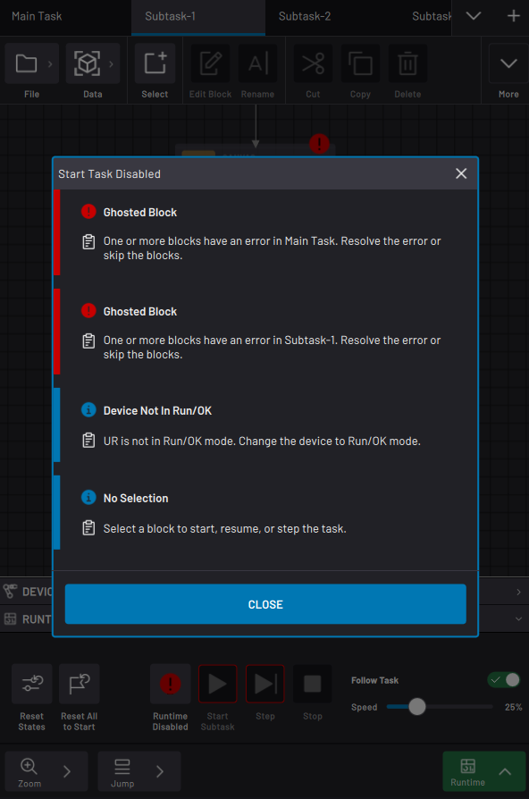
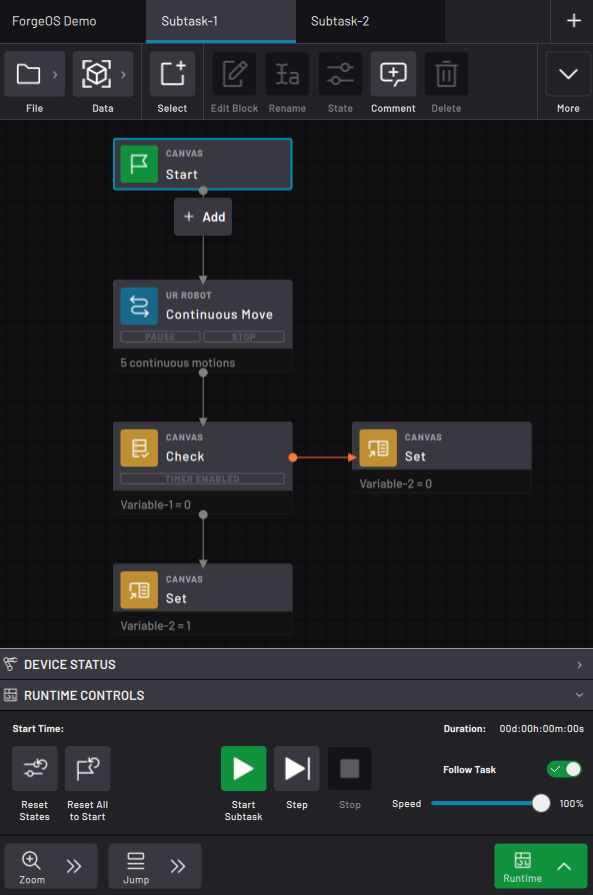
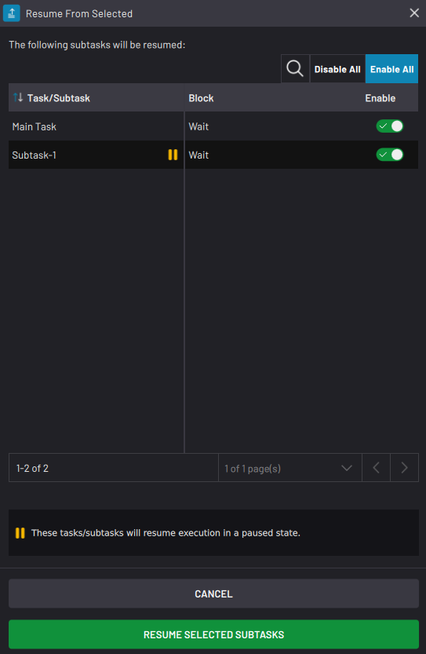

# Running a Task

The Runtime Controls menu is where you execute the task.

Tap the **Runtime** button in the bottom-right corner to open or close the menu. See [Runtime Controls](TaskCanvasOverview.md) for more info on each button.

:::info
You can only access some runtime controls under certain conditions:

-   **Start Task/ Start Subtask/ Resume** is available when a block is highlighted and all devices in [Task Settings](TaskSettings.md) are enabled and in *OK*or *RUN*modes. All Template blocks must be skipped.
-   **Step** is available when the highlighted block is not a Template block and the referenced device \(if any\) is in *OK*, *RUN*, *PROGRAM* or *TEACH* mode.

For more info on Template blocks, see "Special Block States" in [Features of a Task](FeaturesOfATask.md).
:::

If the **Start Task/ Start Subtask/ Resume** button is unavailable, ForgeOS gives pointers on what to fix. 

-   Blue info icons indicate minor recovery actions \(such as selecting a block to start from or switching the robot operational mode\).

-   Red exclamation points indicate actions that are more major \(such as filling in a missing parameter in a template block\).

When you have the Main Task tab open \(and either have not executed blocks yet or have tapped **Reset All to Start**\), the **Start Task** button executes the task from the selected block with the current block states.

When you have a subtask tab open, the Start Task button changes to **Start Subtask**, which executes only that subtask.

If you've executed blocks and have not tapped **Reset All to Start**, the Start Task/ Subtask button reads **Resume**. If you are working with subtasks, a pop-up may ask which subtask\(s\) to resume. In the **Block** column, see where in the flowchart the subtasks will resume from. Toggle the **Enable** switch to specify which subtasks to run \(toggle to the right\) and which subtasks not to run \(toggle to the left\). A subtask that was paused from a Pause Subtask block has a yellow paused icon, and if you enable that subtask, it will resume in a paused state until it gets called by a Resume Subtask block. In the table header, tap **Disable All** to quickly disable all subtasks or **Enable All** to quickly enable all subtasks. You must have at least one subtask enabled to tap **RESUME SELECTED SUBTASKS**.

When you start or resume a task, the task executes until one of these events:

-   The task reaches a Finish block.
-   The task reaches the last block in the flowchart.
-   You stop the task with the Stop button.
-   One of the devices enters an error state, including emergency stop.

