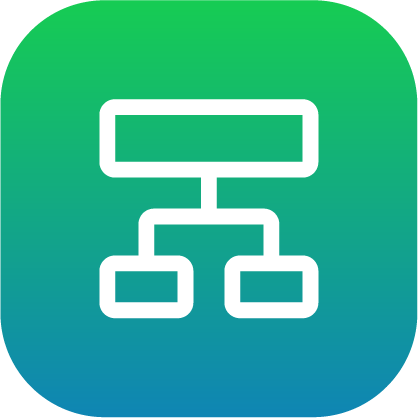

# Task Canvas

## Overview

The Task Canvas app is where you program and execute tasks using your configured devices. Task Canvas controls devices using **blocks**. **Paths** link blocks together to form a **flowchart**. The flowchart executes each block until you stop the task or until the flowchart reaches a final block.

|When you open Task Canvas, the Load Task screen appears. This is where you create or load a task. Once you create and save tasks, they show up in the Load Task table.||

While creating a task, you'll see the **Subtask Tab Bar**, the **Canvas Menu**, the **Canvas**, the **Runtime Controls Menu**, and the **Navigation Tools**.

|No.|Section|Description|
|---|-------|-----------|
|1|Subtask Tab Bar|See the name of the open task and subtasks. Create subtasks by tapping the **+** sign in the right-hand corner. As you add subtasks, this bar fills with tabs that allow you to access those subtasks.

|
|2|Canvas Menu|Access the**File Menu**, **Data Menu**, **Select Mode Toggle**, and **Block Editor**.|
|3|Canvas|Add and organize blocks in a flowchart to create the task.|
|4|Navigation Tools|Navigate the Canvas like a map. Reset the view, zoom in or out, go back to the Start block or last executed block, and Search existing blocks.|
|5|Runtime Controls Menu|Execute the task.|

## Canvas Menu

The Canvas Menu includes the **File Menu**, **Data Menu**, **Select Mode Toggle**, and **Block Editor**.

|No.|Name|Description|
|---|----|-----------|
|1|File Menu|-   Tap **New Task** to create a new task.
-   Tap **Load Task** to open the Load Task screen.
-   Tap **Save Task**to save the open task.
-   Tap **Save Task As**to save the open task as a new file and open the new task.
-   Tap **Task Settings** to change the task information \(name, devices, and tags\). Save the task to commit the updated settings.
-   Tap **Help**to browse information about Task Canvas.
-   Tap **New Subtask**to create a new subtask in the open task. The subtask appears in a tab across the top of the menus.
-   Tap **Rename Subtask**to rename the open subtask. To rename the Main task, use Task Settings.
-   Tap **Duplicate Subtask** to duplicate the open subtask, including its entire flowchart.
-   Tap **Delete Subtask**to delete the open subtask. This does not delete parameters used in the subtask, such as waypoints and variables.
-   Tap **Export Subtask**to export the open subtask as a new task file. This exports the flowchart and any parameters used in it.
-   Tap **Import Subtask**to import an existing task or subtask into the open task as a new subtask.

|
|2|Data Menu|-   Tap **Waypoint Manager**to view, create, and modify waypoints local to the open task.
-   Tap **Frame Manager**to view, create, and modify reference frames local to the open task.
-   Tap **Variable Manager** to view, create, and modify variables local to the task. It also displays variables owned by devices \(like fieldbus devices\).

|
|3|Select Mode Toggle|Toggle to tap/select multiple blocks. Delete, skip, or unskip multiple blocks at one time.|
|4|Block Editor|Change a selected block's settings, rename it, change its execution state, add comments, or delete it.On the right, tap the arrow labeled **More**/**Close**to expand or collapse the menu. In the expanded section:

-   Tap **Undo**to undo an action \(such as block creation, block deletion, or path change\).

**Note:** Undo stores up to 32 steps that can be undone.

-   Tap **Redo**to redo an action that was previously undone.

-   **Cut/Copy** the highlighted block. Tap the location where you want the new block to be and tap **Paste Here**. Tap the green check mark labeled **Paste**to confirm.

-   **Skip**a block. Choose if the task moves on to that block's bottom or right path. Tap **Unskip**to restore the block.

|

## Canvas Navigation

Drag a finger or stylus across the touch screen to pan and scroll. You can also use the Canvas Navigation Tools at the bottom of the screen. There are two Navigation Tool menus. **Zoom**provides canvas view settings. **Jump** centers the view on a specific block.

|Zoom Menu|Description|
|---------|-----------|
|Reset|Reset the view to the default zoom level.|
|Zoom Out|Zoom out to view more of the flowchart.|
|Zoom In|Zoom in to get a closer view of the flowchart.|

|Jump Menu|Description|
|---------|-----------|
|Search|Search for blocks on the canvas. Type an entry to search through: -   Block types \(e.g. Count or Absolute Move\)
-   Custom block names \(from the "Rename" button\)
-   Block devices
-   Internal parameters \(e.g. variables or waypoints\)

|
|Back to Start|Jump to the Start block.|
|Last Executed|Jump to the Last Executed block. The Last Executed block is tagged with a magenta "Step" icon.|

## Runtime Controls

The Runtime Controls menu allows you to execute the task. Tap the **Runtime Controls** button to open or close the menu. The menu remains expanded when a task is executing.

For more on executing a task, see [Running a Task](RunningATask.md).

|No.|Feature|Description|
|---|-------|-----------|
|1|Start Time|View the time that one of the execution buttons was last pressed \(**Start Task**, **Start Subtask**, or **Step**\).|
|2|Duration|View the total execution time of the task. Like a stopwatch, it resets to 0 when you tap **Start Task** or **Start Subtask** and pauses when the task stops.|
|3|Follow Task|Tap the **Follow Task**toggle to center the view on the executing block during Task execution. Follow Task toggles ON whenever a task stops, but you can toggle it OFF before execution.|
|4|Reset States|Tap **Reset States** to set all incremental blocks \(e.g., Wait, Count, Timer, Grid, and Array blocks\) to their initial states. This button also removes any paused states of blocks \(such as paused Continuous Move blocks\) and resets the values of task variables.|
|5|Reset All to Start|Tap **Reset All to Start** to do everything that Reset States can do plus clear the queue of paused subtasks and jump to the Main Task's Start block.|
|6|Start TaskOR

Start Subtask

OR

Resume

|Tap Start Task to start the task from the selected block with the current block states.

For this button to be available, you must have a block selected. If there are any blocks with errors, you must **Skip** them. All referenced devices must be enabled. If you are using a robot, you must put it in **Run** mode.

If you have a subtask open, this button reads **Start Subtask**. In this case, only the visible flowchart will run.

If you’ve executed blocks and have not tapped **Reset All to Start**, the button reads **Resume**. If you are working with subtasks, a pop-up may ask which subtask\(s\) to resume.|
|7|Step|Tap **Step**to execute only the selected block.|
|8|Stop|Tap **Stop**to stop the execution of a block or the Main Task and all subtasks. Stopping a task or block maintains the iterative state of any blocks. The Stop button executes a controlled stop, which is the easiest stop method on mechanical devices in the task. **Important:** Never use the Stop button in an emergency or when an operator's safety is at risk. In such cases, use the emergency stop \(E-Stop\) button.

|
|9|Speed Slider|Use the **Speed Slider** to scale the speed of all robot motion in the task for all robots. If you program an Absolute Move block with 60% acceleration and 80% speed, then you set the Speed Slider to 50%, the block executes with 30% acceleration and 40% speed. When devices in the task are in **Teach**mode, the speed slider defaults to 25% speed. When devices are set to **Run**, the speed slider defaults to 100% speed.

|
|10|Runtime Controls Button|Tap the **Runtime**button to expand or hide the Runtime Controls.|

-   **[Task Management](../TaskCanvas/TaskManagement.md)**  

-   **[Features of a Task](../TaskCanvas/FeaturesOfATask.md)**  

-   **[Multitasking with Subtasks](../TaskCanvas/MultitaskingWithSubtasks.md)**  

-   **[Block Programming](../TaskCanvas/BlockProgramming.md)**  

-   **[Data Management](../TaskCanvas/DataManagement.md)**  

-   **[Running a Task](../TaskCanvas/RunningATask.md)**  

-   **[Using Remote Control Mode](../TaskCanvas/UsingRemoteControlMode.md)**  

-   **[Block Glossary](../TaskCanvasBlockGlossary/BlockGlossaryOverview.md)**  

