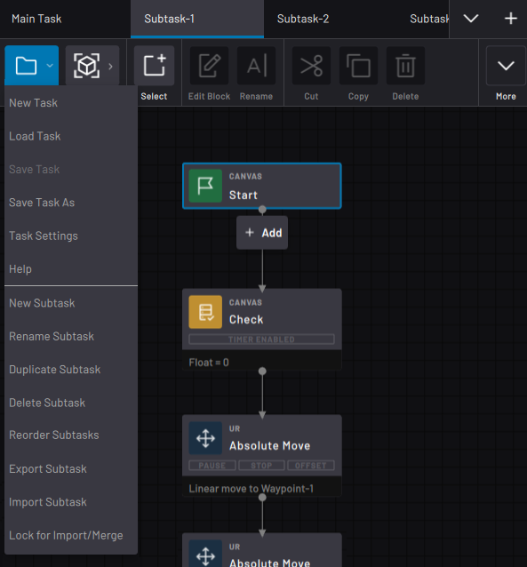

# Task Management

On the left side of the Canvas Menu is the **File menu**. The File menu lets you create or load a task, save the task, open task settings, access Help, and manage subtasks.

-   **[New Task](../TaskCanvas/NewTask.md)**  

-   **[Load Task](../TaskCanvas/LoadTask.md)**  

-   **[Save Task](../TaskCanvas/SaveTask.md)**  

-   **[Task Settings](../TaskCanvas/TaskSettings.md)**  

**Parent topic:**[Task Canvas](../TaskCanvas/TaskCanvasOverview.md)

