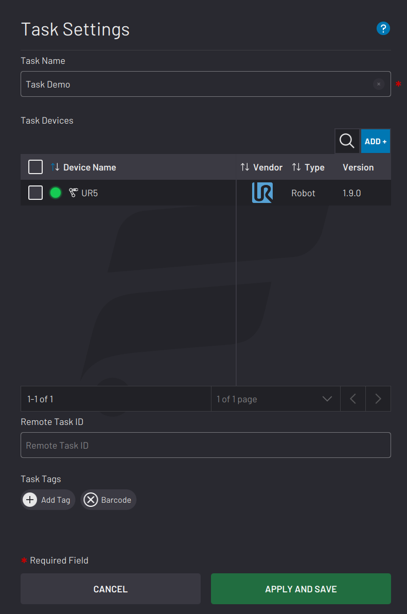
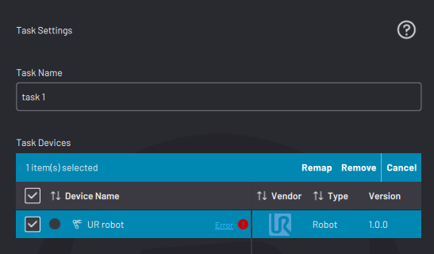
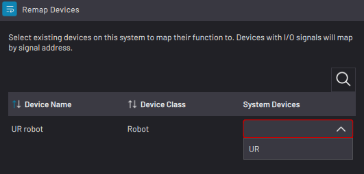
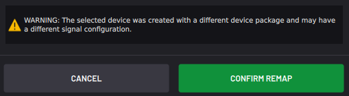

# Task Settings

From the File Menu, tap **Task Settings** to change the settings of your open task.

|In the Task Name field, type in a name to rename the task.

**Note:** Your task name cannot include one or more of the following characters: \` ~ ! \# %^ & \* \\ \| ' " : ; ? / < \>

To add a device to the task, tap **ADD +**. Select the checkbox next to each device that you want to add and tap **ADD**.

If you are using Remote Control mode, type in a **Remote Task ID** to allow the Remote Control Device to identify which task to load. The ID must be a unique, positive integer.

**Tip:** At the bottom, tap**Add Tag** to make the task easier to find later. When searching for the task, enter a tag to filter the search results.

|

|

|In the Task Devices table, select the checkboxes of devices that you want to remap or remove.

**Note:** Removing a device here does NOT remove it from other tasks or from the Device Configuration app.

||

|Tap **Remap** to reassign one or more devices to another device. Select the new device from the **System Devices** dropdown. The remapped device must be of the same device class \(e.g., robot, gripper, sensor, etc.\) as the original device.

To save the device remap, tap **CONFIRM REMAP**.

|

|

**Important:** If you are remapping to a different type of robot, update waypoints in the task's Waypoint Manager. Some parameters \(such as Set blocks for robot I/O\) may require manual reassignment in that block's settings.

Tap **APPLY AND SAVE** to save the changes and return to the Canvas.

**Parent topic:**[Task Management](../TaskCanvas/TaskManagement.md)

