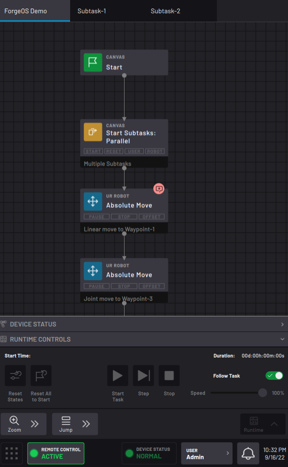

# Using Remote Control Mode

Remote Control mode allows you to communicate with ForgeOS from an external HMI.

|After you configured and enabled this HMI as a **Remote Control Device** in Device Configuration, you can use it in Task Canvas.

Enter and exit Remote Control mode in the Taskbar's **USER** button flyout. When you are in Remote Control mode, the **Remote Control Status** button replaces the Taskbar's app icons.

 While in Remote Control mode, there is limited on-screen interaction with the READY pendant. The Remote Control device sends and receives data, based on what signals you configured for its inputs and outputs.

||

**Parent topic:**[Task Canvas](../TaskCanvas/TaskCanvasOverview.md)

