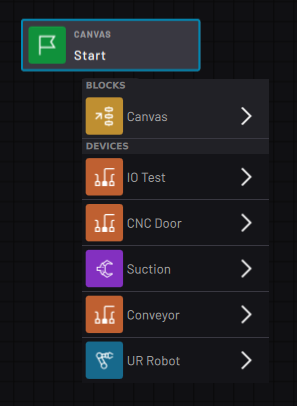

# Block Glossary

The types of **blocks** available in Task Canvas depend on the devices you added in Task Settings.

Add blocks to a task from the **Block Menu**. The Block Menu organizes block types by device, except for the Canvas blocks. **Canvas** blocks are not specific to any device. Some of them can control multiple devices and others control flowchart logic or variables.

-   **[Canvas Blocks](../TaskCanvasBlockGlossary/Canvas-Overview.md)**  
-   **[Robot Blocks](../TaskCanvasBlockGlossary/Robot-Overview.md)**  
-   **[Forge/Ctrl Blocks](../TaskCanvasBlockGlossary/Device-ForgeCtrl.md)**  
-   **[Network Device Blocks](../TaskCanvasBlockGlossary/Device-Network.md)**  
-   **[Serial Device Blocks](../TaskCanvasBlockGlossary/Device-Serial.md)**  
-   **[Smart Gripper Blocks](../TaskCanvasBlockGlossary/Device-SmartGripper.md)** 
-   **[Force Sensor Blocks](../TaskCanvasBlockGlossary/Device-ForceSensor.md)**  
-   **[Clamping Gripper Blocks](../TaskCanvasBlockGlossary/Device-ClampingGripper.md)**  
-   **[Lifting Gripper Blocks](../TaskCanvasBlockGlossary/Device-LiftingGripper.md)**  
-   **[Generic IO Device Blocks](../TaskCanvasBlockGlossary/Device-GenericIODevice.md)**  
-   **[Button Presser Blocks](../TaskCanvasBlockGlossary/Device-ButtonPresser.md)**  
-   **[Pedal Presser Blocks](../TaskCanvasBlockGlossary/Device-PedalPresser.md)**  
 

