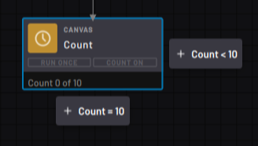
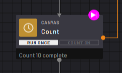
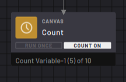

# Count Block

The Count block counts up from zero to a chosen number. Each time the block executes, the count increases by one, then the path taken depends on the count value.

- The task follows the right **Count <** path when the count is less than the chosen value.

- The task follows the bottom **Count =** path after the count reaches the chosen value.

By default, the count resets to "0" after reaching the chosen value. Then the next time the task executes the block, it counts to "1" and follows the right path.

In the Count block settings, choose the **Count to** value.

When the **Run Once** toggle is enabled, the Count does not reset when the Count to value is reached. After it reaches its maximum value, it reads "Count X complete". If the task executes the block again, it follows the bottom path.

When the **Count on Variable** toggle is enabled, the Count is set by the value of an integer variable. This variable can be referenced and used elsewhere in the task. Stepping the block or changing its state will change all other instances of the variable, and changes from any other instances of the variable will also change the Count.

To repeat a section of blocks with a Count block, add the Count block **at the end of the section** and **Connect** the right path of the Count block to the **start of the section.** Use Count blocks to create repeating loops in a task. Use the defined value to set how many times the loop repeats before moving on in the task.

A Count block must have a right path. If there is no right path, the task ends as soon as the Count block is executed.

