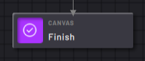
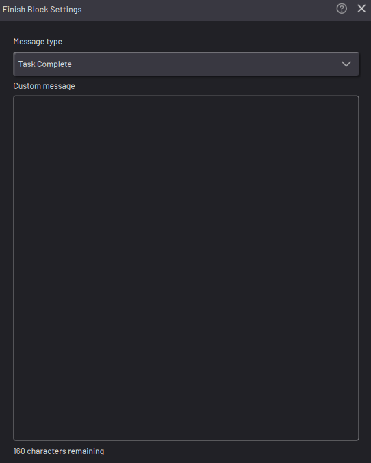
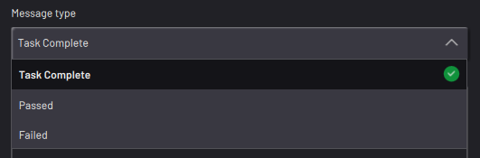

# Finish Block

The Finish block marks the end of the task.

|A task doesn't need a Finish block to end, but use a Finish block to mark where you expect the task to end. Depending on the complexity of your task, it may use multiple Finish blocks.

||

|**Note:** A Finish block in any subtask stops the entire task, including the Main Task and all subtasks. Only use the Finish block when you want to stop the entire task.

In the Finish block settings, type in a custom message that appears when the Finish block executes.

|

|

|Expand the **Message Type** dropdown to choose the pop-up that appears when the task completes, passes, or fails.

||

**Parent topic:**[Canvas Blocks](../TaskCanvasBlockGlossary/Canvas-Overview.md)

